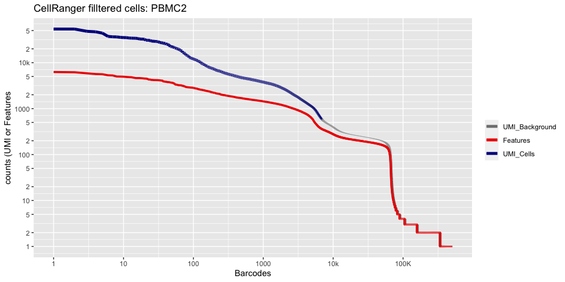
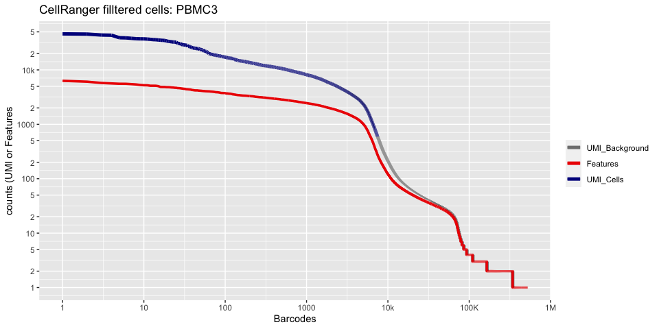
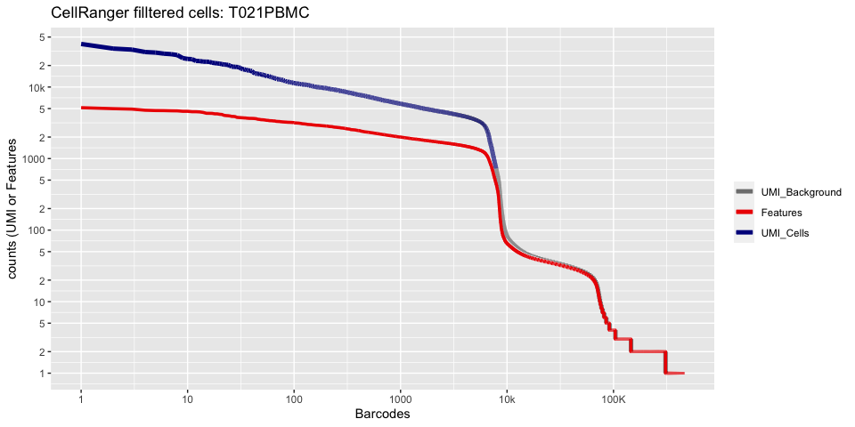
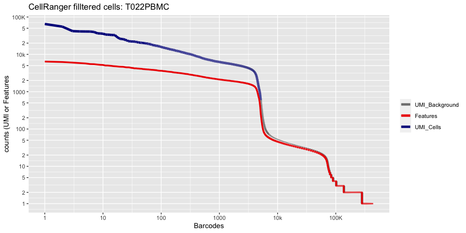
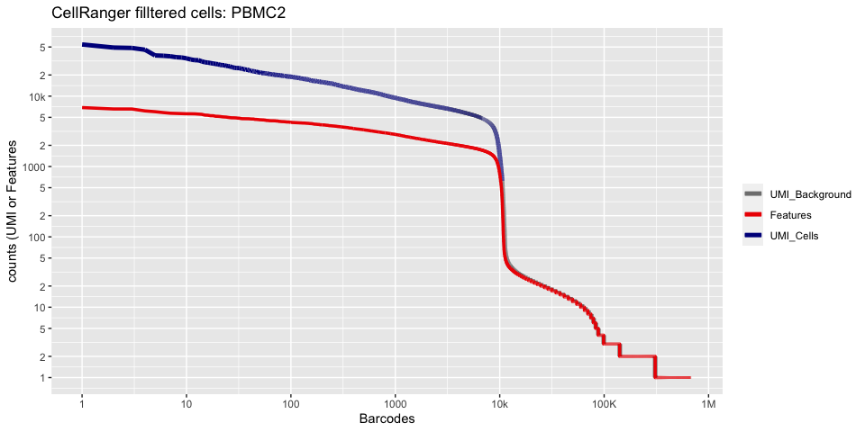

Last Updated: March 23 2021, 5pm

# Part 1: Loading data from CellRanger into R

Our first Markdown document concentrates on getting data into R and setting up our initial object.

## Single Cell Analysis with Seurat and some custom code!

[Seurat](http://satijalab.org/seurat/) (now Version 4) is a popular R package that is designed for QC, analysis, and exploration of single cell data. Seurat aims to enable users to identify and interpret sources of heterogeneity from single cell transcriptomic measurements, and to integrate diverse types of single cell data. Further, the authors provide several [tutorials](https://satijalab.org/seurat/vignettes.html), on their website.

The **intro2singlecell_March2021.zip** file contains the single cell matrix files and HDF5 files for four Covid positive PBMc samples. These are PBMC human cells ran on the 10X genomics platform (5' gene expression kit V2 with b-cell VDJ) for single cell RNA sequencing, sequenced with UC Davis in Nov and Dec of 2020 on a NovaSeq 6000. The experiment for the workshop contains 4 samples, each merged from 2 original samples and "normal" PBMC data from 10X Genomics.


The four samples are,
* PBMC2 - Performed in Nov
* PBMC3 - Performed in Nov
* T021 - Performed in Dec
* T022 - Performed in Dec

Also in the directory is the 10X "normal" PBMC dataset

We start each markdown document with loading needed libraries for R


```r
# must have Seurat
library(Seurat)
library(kableExtra)
library(ggplot2)
```


### Setup the experiment folder and data info

```r
experiment_name = "Covid Example"
dataset_loc <- "./intro2singlecell_March2021"
ids <- c("PBMC2", "PBMC3", "T021PBMC", "T022PBMC")
```


## Read in the cellranger sample metrics csv files

```r
d10x.metrics <- lapply(ids, function(i){
  # remove _Counts is if names don't include them
  metrics <- read.csv(file.path(dataset_loc,paste0(i,"_Counts/outs"),"metrics_summary.csv"), colClasses = "character")
})
experiment.metrics <- do.call("rbind", d10x.metrics)
rownames(experiment.metrics) <- ids

sequencing_metrics <- data.frame(t(experiment.metrics[,c(4:17,1,18,2,3,19,20)]))

row.names(sequencing_metrics) <- gsub("\\."," ", rownames(sequencing_metrics))
```

And lets generate a pretty table


```r
sequencing_metrics %>%
  kable(caption = 'Cell Ranger Results') %>%
  pack_rows("Sequencing Characteristics", 1, 7, label_row_css = "background-color: #666; color: #fff;") %>%
  pack_rows("Mapping Characteristics", 8, 14, label_row_css = "background-color: #666; color: #fff;") %>%
  pack_rows("Cell Characteristics", 15, 20, label_row_css = "background-color: #666; color: #fff;") %>%
  kable_styling("striped")
```

<table class="table table-striped" style="margin-left: auto; margin-right: auto;">
<caption>Cell Ranger Results</caption>
 <thead>
  <tr>
   <th style="text-align:left;">   </th>
   <th style="text-align:left;"> PBMC2 </th>
   <th style="text-align:left;"> PBMC3 </th>
   <th style="text-align:left;"> T021PBMC </th>
   <th style="text-align:left;"> T022PBMC </th>
  </tr>
 </thead>
<tbody>
  <tr grouplength="7"><td colspan="5" style="background-color: #666; color: #fff;"><strong>Sequencing Characteristics</strong></td></tr>
<tr>
   <td style="text-align:left;padding-left: 2em;" indentlevel="1"> Number of Reads </td>
   <td style="text-align:left;"> 313,087,958 </td>
   <td style="text-align:left;"> 339,008,152 </td>
   <td style="text-align:left;"> 364,881,065 </td>
   <td style="text-align:left;"> 358,269,446 </td>
  </tr>
  <tr>
   <td style="text-align:left;padding-left: 2em;" indentlevel="1"> Valid Barcodes </td>
   <td style="text-align:left;"> 85.1% </td>
   <td style="text-align:left;"> 82.0% </td>
   <td style="text-align:left;"> 91.5% </td>
   <td style="text-align:left;"> 91.0% </td>
  </tr>
  <tr>
   <td style="text-align:left;padding-left: 2em;" indentlevel="1"> Sequencing Saturation </td>
   <td style="text-align:left;"> 78.8% </td>
   <td style="text-align:left;"> 76.5% </td>
   <td style="text-align:left;"> 85.2% </td>
   <td style="text-align:left;"> 87.3% </td>
  </tr>
  <tr>
   <td style="text-align:left;padding-left: 2em;" indentlevel="1"> Q30 Bases in Barcode </td>
   <td style="text-align:left;"> 97.2% </td>
   <td style="text-align:left;"> 97.1% </td>
   <td style="text-align:left;"> 94.3% </td>
   <td style="text-align:left;"> 94.4% </td>
  </tr>
  <tr>
   <td style="text-align:left;padding-left: 2em;" indentlevel="1"> Q30 Bases in RNA Read </td>
   <td style="text-align:left;"> 94.5% </td>
   <td style="text-align:left;"> 94.5% </td>
   <td style="text-align:left;"> 87.3% </td>
   <td style="text-align:left;"> 87.4% </td>
  </tr>
  <tr>
   <td style="text-align:left;padding-left: 2em;" indentlevel="1"> Q30 Bases in RNA Read 2 </td>
   <td style="text-align:left;"> 91.1% </td>
   <td style="text-align:left;"> 91.1% </td>
   <td style="text-align:left;"> 89.3% </td>
   <td style="text-align:left;"> 88.7% </td>
  </tr>
  <tr>
   <td style="text-align:left;padding-left: 2em;" indentlevel="1"> Q30 Bases in UMI </td>
   <td style="text-align:left;"> 96.9% </td>
   <td style="text-align:left;"> 96.9% </td>
   <td style="text-align:left;"> 93.9% </td>
   <td style="text-align:left;"> 94.0% </td>
  </tr>
  <tr grouplength="7"><td colspan="5" style="background-color: #666; color: #fff;"><strong>Mapping Characteristics</strong></td></tr>
<tr>
   <td style="text-align:left;padding-left: 2em;" indentlevel="1"> Reads Mapped to Genome </td>
   <td style="text-align:left;"> 91.2% </td>
   <td style="text-align:left;"> 91.3% </td>
   <td style="text-align:left;"> 90.9% </td>
   <td style="text-align:left;"> 90.0% </td>
  </tr>
  <tr>
   <td style="text-align:left;padding-left: 2em;" indentlevel="1"> Reads Mapped Confidently to Genome </td>
   <td style="text-align:left;"> 70.0% </td>
   <td style="text-align:left;"> 69.4% </td>
   <td style="text-align:left;"> 83.5% </td>
   <td style="text-align:left;"> 82.9% </td>
  </tr>
  <tr>
   <td style="text-align:left;padding-left: 2em;" indentlevel="1"> Reads Mapped Confidently to Intergenic Regions </td>
   <td style="text-align:left;"> 5.8% </td>
   <td style="text-align:left;"> 5.5% </td>
   <td style="text-align:left;"> 4.1% </td>
   <td style="text-align:left;"> 4.4% </td>
  </tr>
  <tr>
   <td style="text-align:left;padding-left: 2em;" indentlevel="1"> Reads Mapped Confidently to Intronic Regions </td>
   <td style="text-align:left;"> 8.9% </td>
   <td style="text-align:left;"> 7.3% </td>
   <td style="text-align:left;"> 6.6% </td>
   <td style="text-align:left;"> 6.9% </td>
  </tr>
  <tr>
   <td style="text-align:left;padding-left: 2em;" indentlevel="1"> Reads Mapped Confidently to Exonic Regions </td>
   <td style="text-align:left;"> 55.3% </td>
   <td style="text-align:left;"> 56.7% </td>
   <td style="text-align:left;"> 72.9% </td>
   <td style="text-align:left;"> 71.6% </td>
  </tr>
  <tr>
   <td style="text-align:left;padding-left: 2em;" indentlevel="1"> Reads Mapped Confidently to Transcriptome </td>
   <td style="text-align:left;"> 48.6% </td>
   <td style="text-align:left;"> 48.2% </td>
   <td style="text-align:left;"> 67.3% </td>
   <td style="text-align:left;"> 65.6% </td>
  </tr>
  <tr>
   <td style="text-align:left;padding-left: 2em;" indentlevel="1"> Reads Mapped Antisense to Gene </td>
   <td style="text-align:left;"> 4.3% </td>
   <td style="text-align:left;"> 6.5% </td>
   <td style="text-align:left;"> 3.0% </td>
   <td style="text-align:left;"> 3.4% </td>
  </tr>
  <tr grouplength="6"><td colspan="5" style="background-color: #666; color: #fff;"><strong>Cell Characteristics</strong></td></tr>
<tr>
   <td style="text-align:left;padding-left: 2em;" indentlevel="1"> Estimated Number of Cells </td>
   <td style="text-align:left;"> 6,914 </td>
   <td style="text-align:left;"> 7,483 </td>
   <td style="text-align:left;"> 7,891 </td>
   <td style="text-align:left;"> 5,120 </td>
  </tr>
  <tr>
   <td style="text-align:left;padding-left: 2em;" indentlevel="1"> Fraction Reads in Cells </td>
   <td style="text-align:left;"> 53.2% </td>
   <td style="text-align:left;"> 89.5% </td>
   <td style="text-align:left;"> 92.0% </td>
   <td style="text-align:left;"> 92.6% </td>
  </tr>
  <tr>
   <td style="text-align:left;padding-left: 2em;" indentlevel="1"> Mean Reads per Cell </td>
   <td style="text-align:left;"> 45,283 </td>
   <td style="text-align:left;"> 45,304 </td>
   <td style="text-align:left;"> 46,240 </td>
   <td style="text-align:left;"> 69,975 </td>
  </tr>
  <tr>
   <td style="text-align:left;padding-left: 2em;" indentlevel="1"> Median Genes per Cell </td>
   <td style="text-align:left;"> 840 </td>
   <td style="text-align:left;"> 1,385 </td>
   <td style="text-align:left;"> 1,506 </td>
   <td style="text-align:left;"> 1,739 </td>
  </tr>
  <tr>
   <td style="text-align:left;padding-left: 2em;" indentlevel="1"> Total Genes Detected </td>
   <td style="text-align:left;"> 20,425 </td>
   <td style="text-align:left;"> 20,681 </td>
   <td style="text-align:left;"> 21,012 </td>
   <td style="text-align:left;"> 20,774 </td>
  </tr>
  <tr>
   <td style="text-align:left;padding-left: 2em;" indentlevel="1"> Median UMI Counts per Cell </td>
   <td style="text-align:left;"> 1,506 </td>
   <td style="text-align:left;"> 3,384 </td>
   <td style="text-align:left;"> 3,912 </td>
   <td style="text-align:left;"> 4,736 </td>
  </tr>
</tbody>
</table>


## Load the Cell Ranger Matrix Data and create the base Seurat object.
Cell Ranger provides a function `cellranger aggr` that will combine multiple samples into a single matrix file. However, when processing data in R this is unnecessary and we can quickly aggregate them in R.

Seurat provides a function `Read10X` and `Read10X_h5` to read in 10X data folder. First we read in data from each individual sample folder. 

Later, we initialize the Seurat object (`CreateSeuratObject`) with the raw (non-normalized data). Keep all cells with at least 200 detected genes. Also extracting sample names, calculating and adding in the metadata mitochondrial percentage of each cell. Adding in the metadata batchid and cell cycle. Finally, saving the raw Seurat object.

## Load the Cell Ranger Matrix Data (hdf5 file) and create the base Seurat object.

```r
d10x.data <- lapply(ids, function(i){
  d10x <- Read10X_h5(file.path(dataset_loc,paste0(i,"_Counts/outs"),"raw_feature_bc_matrix.h5"))
  colnames(d10x) <- paste(sapply(strsplit(colnames(d10x),split="-"),'[[',1L),i,sep="-")
  d10x
})
names(d10x.data) <- ids

str(d10x.data)
```

<div class='r_output'> List of 4
  $ PBMC2   :Formal class 'dgCMatrix' [package "Matrix"] with 6 slots
   .. ..@ i       : int [1:18215841] 84 565 796 915 943 975 1475 1832 2059 2061 ...
   .. ..@ p       : int [1:507423] 0 206 207 208 209 432 437 437 439 441 ...
   .. ..@ Dim     : int [1:2] 36601 507422
   .. ..@ Dimnames:List of 2
   .. .. ..$ : chr [1:36601] "MIR1302-2HG" "FAM138A" "OR4F5" "AL627309.1" ...
   .. .. ..$ : chr [1:507422] "AAACCTGAGAAACCAT-PBMC2" "AAACCTGAGAAACCGC-PBMC2" "AAACCTGAGAACAACT-PBMC2" "AAACCTGAGAACAATC-PBMC2" ...
   .. ..@ x       : num [1:18215841] 1 1 1 1 1 1 1 1 1 1 ...
   .. ..@ factors : list()
  $ PBMC3   :Formal class 'dgCMatrix' [package "Matrix"] with 6 slots
   .. ..@ i       : int [1:14111379] 1832 34974 593 847 1944 2061 4261 8706 11613 12196 ...
   .. ..@ p       : int [1:522341] 0 2 31 32 34 34 34 34 34 34 ...
   .. ..@ Dim     : int [1:2] 36601 522340
   .. ..@ Dimnames:List of 2
   .. .. ..$ : chr [1:36601] "MIR1302-2HG" "FAM138A" "OR4F5" "AL627309.1" ...
   .. .. ..$ : chr [1:522340] "AAACCTGAGAAACCAT-PBMC3" "AAACCTGAGAAACCTA-PBMC3" "AAACCTGAGAAACGAG-PBMC3" "AAACCTGAGAAACGCC-PBMC3" ...
   .. ..@ x       : num [1:14111379] 1 1 1 1 1 1 1 1 1 1 ...
   .. ..@ factors : list()
  $ T021PBMC:Formal class 'dgCMatrix' [package "Matrix"] with 6 slots
   .. ..@ i       : int [1:14523505] 35378 29289 2314 21806 25903 10801 18939 28506 10468 33707 ...
   .. ..@ p       : int [1:464418] 0 1 2 2 4 5 8 9 11 11 ...
   .. ..@ Dim     : int [1:2] 36601 464417
   .. ..@ Dimnames:List of 2
   .. .. ..$ : chr [1:36601] "MIR1302-2HG" "FAM138A" "OR4F5" "AL627309.1" ...
   .. .. ..$ : chr [1:464417] "AAACCTGAGAAACCGC-T021PBMC" "AAACCTGAGAAAGTGG-T021PBMC" "AAACCTGAGAACAACT-T021PBMC" "AAACCTGAGAACAATC-T021PBMC" ...
   .. ..@ x       : num [1:14523505] 1 1 1 1 1 2 1 1 1 1 ...
   .. ..@ factors : list()
  $ T022PBMC:Formal class 'dgCMatrix' [package "Matrix"] with 6 slots
   .. ..@ i       : int [1:11234467] 53 610 2542 4334 4393 4421 5765 6163 7502 8756 ...
   .. ..@ p       : int [1:438469] 0 0 0 43 46 46 68 99 100 105 ...
   .. ..@ Dim     : int [1:2] 36601 438468
   .. ..@ Dimnames:List of 2
   .. .. ..$ : chr [1:36601] "MIR1302-2HG" "FAM138A" "OR4F5" "AL627309.1" ...
   .. .. ..$ : chr [1:438468] "AAACCTGAGAAACCTA-T022PBMC" "AAACCTGAGAAACGAG-T022PBMC" "AAACCTGAGAAACGCC-T022PBMC" "AAACCTGAGAAAGTGG-T022PBMC" ...
   .. ..@ x       : num [1:11234467] 1 1 1 1 4 2 1 1 1 1 ...
   .. ..@ factors : list()
</div>
If you don't have the needed hdf5 libraries you can read in the matrix files like such


```r
d10x.data <- sapply(ids, function(i){
  d10x <- Read10X(file.path(dataset_loc,paste0(i,"_Counts/outs"),"raw_feature_bc_matrix"))
  colnames(d10x) <- paste(sapply(strsplit(colnames(d10x),split="-"),'[[',1L),i,sep="-")
  d10x
})
names(d10x.data) <- ids
```


Lets recreate the pretty cellranger html plot

```r
cr_filtered_cells <- as.numeric(gsub(",","",as.character(unlist(sequencing_metrics["Estimated Number of Cells",]))))

plot_cellranger_cells <- function(ind){
  xbreaks = c(1,1e1,1e2,1e3,1e4,1e5,1e6)
  xlabels = c("1","10","100","1000","10k","100K","1M")
  ybreaks = c(1,2,5,10,20,50,100,200,500,1000,2000,5000,10000,20000,50000,100000,200000,500000,1000000)
  ylabels = c("1","2","5","10","2","5","100","2","5","1000","2","5","10k","2","5","100K","2","5","1M")

  pl1 <- data.frame(index=seq.int(1,ncol(d10x.data[[ind]])), nCount_RNA = sort(Matrix:::colSums(d10x.data[[ind]])+1,decreasing=T), nFeature_RNA = sort(Matrix:::colSums(d10x.data[[ind]]>0)+1,decreasing=T)) %>% ggplot() + 
    scale_color_manual(values=c("grey50","red2","blue4"), labels=c("UMI_Background", "Features", "UMI_Cells"), name=NULL) +
    ggtitle(paste("CellRanger filltered cells:",ids[ind],sep=" ")) + xlab("Barcodes") + ylab("counts (UMI or Features") + 
    scale_x_continuous(trans = 'log2', breaks=xbreaks, labels = xlabels) + 
    scale_y_continuous(trans = 'log2', breaks=ybreaks, labels = ylabels) +
    geom_line(aes(x=index, y=nCount_RNA, color=index<=cr_filtered_cells[ind] , group=1), size=1.75) +
    geom_line(aes(x=index, y=nFeature_RNA, color="Features", group=1), size=1.25)

  return(pl1)
}

plot_cellranger_cells(1)
```

<!-- -->

```r
plot_cellranger_cells(2)
```

<!-- -->

```r
plot_cellranger_cells(3)
```

<!-- -->

```r
plot_cellranger_cells(4)
```

<!-- -->


### Create the Seurat object

filter criteria: remove genes that do not occur in a minimum of 0 cells and remove cells that don't have a minimum of 200 features


```r
experiment.data <- do.call("cbind", d10x.data)

experiment.aggregate <- CreateSeuratObject(
  experiment.data,
  project = experiment_name,
  min.cells = 0,
  min.features = 300,
  names.field = 2,
  names.delim = "\\-")

experiment.aggregate
```

<div class='r_output'> An object of class Seurat 
 36601 features across 29696 samples within 1 assay 
 Active assay: RNA (36601 features, 0 variable features)
</div>
```r
str(experiment.aggregate)
```

<div class='r_output'> Formal class 'Seurat' [package "SeuratObject"] with 13 slots
   ..@ assays      :List of 1
   .. ..$ RNA:Formal class 'Assay' [package "SeuratObject"] with 8 slots
   .. .. .. ..@ counts       :Formal class 'dgCMatrix' [package "Matrix"] with 6 slots
   .. .. .. .. .. ..@ i       : int [1:39483327] 62 78 438 524 631 647 829 920 975 1073 ...
   .. .. .. .. .. ..@ p       : int [1:29697] 0 335 758 2331 3315 4444 4760 5983 7391 8653 ...
   .. .. .. .. .. ..@ Dim     : int [1:2] 36601 29696
   .. .. .. .. .. ..@ Dimnames:List of 2
   .. .. .. .. .. .. ..$ : chr [1:36601] "MIR1302-2HG" "FAM138A" "OR4F5" "AL627309.1" ...
   .. .. .. .. .. .. ..$ : chr [1:29696] "AAACCTGAGCTAGTGG-PBMC2" "AAACCTGAGGCCCTTG-PBMC2" "AAACCTGAGGTGTGGT-PBMC2" "AAACCTGAGTCATGCT-PBMC2" ...
   .. .. .. .. .. ..@ x       : num [1:39483327] 1 1 1 1 1 1 1 1 1 1 ...
   .. .. .. .. .. ..@ factors : list()
   .. .. .. ..@ data         :Formal class 'dgCMatrix' [package "Matrix"] with 6 slots
   .. .. .. .. .. ..@ i       : int [1:39483327] 62 78 438 524 631 647 829 920 975 1073 ...
   .. .. .. .. .. ..@ p       : int [1:29697] 0 335 758 2331 3315 4444 4760 5983 7391 8653 ...
   .. .. .. .. .. ..@ Dim     : int [1:2] 36601 29696
   .. .. .. .. .. ..@ Dimnames:List of 2
   .. .. .. .. .. .. ..$ : chr [1:36601] "MIR1302-2HG" "FAM138A" "OR4F5" "AL627309.1" ...
   .. .. .. .. .. .. ..$ : chr [1:29696] "AAACCTGAGCTAGTGG-PBMC2" "AAACCTGAGGCCCTTG-PBMC2" "AAACCTGAGGTGTGGT-PBMC2" "AAACCTGAGTCATGCT-PBMC2" ...
   .. .. .. .. .. ..@ x       : num [1:39483327] 1 1 1 1 1 1 1 1 1 1 ...
   .. .. .. .. .. ..@ factors : list()
   .. .. .. ..@ scale.data   : num[0 , 0 ] 
   .. .. .. ..@ key          : chr "rna_"
   .. .. .. ..@ assay.orig   : NULL
   .. .. .. ..@ var.features : logi(0) 
   .. .. .. ..@ meta.features:'data.frame':	36601 obs. of  0 variables
   .. .. .. ..@ misc         : list()
   ..@ meta.data   :'data.frame':	29696 obs. of  3 variables:
   .. ..$ orig.ident  : Factor w/ 4 levels "PBMC2","PBMC3",..: 1 1 1 1 1 1 1 1 1 1 ...
   .. ..$ nCount_RNA  : num [1:29696] 453 596 3606 1510 1856 ...
   .. ..$ nFeature_RNA: int [1:29696] 335 423 1573 984 1129 316 1223 1408 1262 872 ...
   ..@ active.assay: chr "RNA"
   ..@ active.ident: Factor w/ 4 levels "PBMC2","PBMC3",..: 1 1 1 1 1 1 1 1 1 1 ...
   .. ..- attr(*, "names")= chr [1:29696] "AAACCTGAGCTAGTGG-PBMC2" "AAACCTGAGGCCCTTG-PBMC2" "AAACCTGAGGTGTGGT-PBMC2" "AAACCTGAGTCATGCT-PBMC2" ...
   ..@ graphs      : list()
   ..@ neighbors   : list()
   ..@ reductions  : list()
   ..@ images      : list()
   ..@ project.name: chr "Covid Example"
   ..@ misc        : list()
   ..@ version     :Classes 'package_version', 'numeric_version'  hidden list of 1
   .. ..$ : int [1:3] 4 0 0
   ..@ commands    : list()
   ..@ tools       : list()
</div>
## Load the Cell Ranger Matrix Data with multiple tables (hdf5 file only) and create the base Seurat object.

```r
normals <- c("10x_NormalPBMC_multi")

d10x.metrics <- lapply(normals, function(i){
  # remove _Counts is my names don't include them
  metrics <- read.csv(file.path(dataset_loc,paste0(i,"/outs"),"metrics_summary.csv"), colClasses = "character")
  metrics <- metrics[metrics$Library.Type == "Gene Expression",]
  metrics.new <- metrics$Metric.Value
  names(metrics.new) <- metrics$Metric.Name
  metrics.new
})

normal.metrics <- do.call("rbind", d10x.metrics)
rownames(normal.metrics) <- normals


d10x.normal <- lapply(normals, function(i){
  d10x <- Read10X_h5(file.path(dataset_loc,paste0(i,"/outs"),"raw_feature_bc_matrix.h5"))
  colnames(d10x$`Gene Expression`) <- paste(sapply(strsplit(colnames(d10x$`Gene Expression`),split="-"),'[[',1L),i,sep="-")
  colnames(d10x$`Antibody Capture`) <- paste(sapply(strsplit(colnames(d10x$`Antibody Capture`),split="-"),'[[',1L),i,sep="-")
  d10x
})
names(d10x.normal) <- normals

str(d10x.normal)
```

<div class='r_output'> List of 1
  $ 10x_NormalPBMC_multi:List of 2
   ..$ Gene Expression :Formal class 'dgCMatrix' [package "Matrix"] with 6 slots
   .. .. ..@ i       : int [1:21790216] 36386 31111 8220 31199 23735 32047 13246 26119 724 2093 ...
   .. .. ..@ p       : int [1:702408] 0 1 1 2 4 4 4 4 4 4 ...
   .. .. ..@ Dim     : int [1:2] 36601 702407
   .. .. ..@ Dimnames:List of 2
   .. .. .. ..$ : chr [1:36601] "MIR1302-2HG" "FAM138A" "OR4F5" "AL627309.1" ...
   .. .. .. ..$ : chr [1:702407] "AAACCTGAGAAACCAT-10x_NormalPBMC_multi" "AAACCTGAGAAACCGC-10x_NormalPBMC_multi" "AAACCTGAGAAACCTA-10x_NormalPBMC_multi" "AAACCTGAGAAACGAG-10x_NormalPBMC_multi" ...
   .. .. ..@ x       : num [1:21790216] 1 1 1 1 1 2 1 1 1 1 ...
   .. .. ..@ factors : list()
   ..$ Antibody Capture:Formal class 'dgCMatrix' [package "Matrix"] with 6 slots
   .. .. ..@ i       : int [1:3020346] 3 13 4 10 13 0 2 3 4 8 ...
   .. .. ..@ p       : int [1:702408] 0 0 2 3 3 5 7 7 10 12 ...
   .. .. ..@ Dim     : int [1:2] 19 702407
   .. .. ..@ Dimnames:List of 2
   .. .. .. ..$ : chr [1:19] "CD3_TotalC" "CD19_TotalC" "CD45RA_TotalC" "CD4_TotalC" ...
   .. .. .. ..$ : chr [1:702407] "AAACCTGAGAAACCAT-10x_NormalPBMC_multi" "AAACCTGAGAAACCGC-10x_NormalPBMC_multi" "AAACCTGAGAAACCTA-10x_NormalPBMC_multi" "AAACCTGAGAAACGAG-10x_NormalPBMC_multi" ...
   .. .. ..@ x       : num [1:3020346] 1 1 1 1 1 1 1 1 1 1 ...
   .. .. ..@ factors : list()
</div>
How does d10x.data differ from d10x.normal?


```r
cr_filtered_cells <- as.numeric(gsub(",","",as.character(unlist(normal.metrics[, "Estimated number of cells" ]))))

plot_cellranger_cells <- function(ind){
  xbreaks = c(1,1e1,1e2,1e3,1e4,1e5,1e6)
  xlabels = c("1","10","100","1000","10k","100K","1M")
  ybreaks = c(1,2,5,10,20,50,100,200,500,1000,2000,5000,10000,20000,50000,100000,200000,500000,1000000)
  ylabels = c("1","2","5","10","2","5","100","2","5","1000","2","5","10k","2","5","100K","2","5","1M")

  pl1 <- data.frame(index=seq.int(1,ncol(d10x.normal[[ind]][["Gene Expression"]])), nCount_RNA = sort(Matrix:::colSums(d10x.normal[[ind]][["Gene Expression"]])+1,decreasing=T), nFeature_RNA = sort(Matrix:::colSums(d10x.normal[[ind]][["Gene Expression"]]>0)+1,decreasing=T)) %>% ggplot() + 
    scale_color_manual(values=c("grey50","red2","blue4"), labels=c("UMI_Background", "Features", "UMI_Cells"), name=NULL) +
    ggtitle(paste("CellRanger filltered cells:",ids[ind],sep=" ")) + xlab("Barcodes") + ylab("counts (UMI or Features") + 
    scale_x_continuous(trans = 'log2', breaks=xbreaks, labels = xlabels) + 
    scale_y_continuous(trans = 'log2', breaks=ybreaks, labels = ylabels) +
    geom_line(aes(x=index, y=nCount_RNA, color=index<=cr_filtered_cells[ind] , group=1), size=1.75) +
    geom_line(aes(x=index, y=nFeature_RNA, color="Features", group=1), size=1.25)

  return(pl1)
}

plot_cellranger_cells(1)
```

<!-- -->


### Create the Seurat object

filter criteria: remove genes that do not occur in a minimum of 0 cells and remove cells that don't have a minimum of 200 features


```r
experiment.normal <- do.call("cbind", lapply(d10x.normal,"[[", "Gene Expression"))

experiment.aggregate.normal <- CreateSeuratObject(
  experiment.normal,
  project = "Normals",
  min.cells = 0,
  min.features = 300,
  names.field = 2,
  names.delim = "\\-")

experiment.aggregate
```

<div class='r_output'> An object of class Seurat 
 36601 features across 29696 samples within 1 assay 
 Active assay: RNA (36601 features, 0 variable features)
</div>
```r
str(experiment.aggregate)
```

<div class='r_output'> Formal class 'Seurat' [package "SeuratObject"] with 13 slots
   ..@ assays      :List of 1
   .. ..$ RNA:Formal class 'Assay' [package "SeuratObject"] with 8 slots
   .. .. .. ..@ counts       :Formal class 'dgCMatrix' [package "Matrix"] with 6 slots
   .. .. .. .. .. ..@ i       : int [1:39483327] 62 78 438 524 631 647 829 920 975 1073 ...
   .. .. .. .. .. ..@ p       : int [1:29697] 0 335 758 2331 3315 4444 4760 5983 7391 8653 ...
   .. .. .. .. .. ..@ Dim     : int [1:2] 36601 29696
   .. .. .. .. .. ..@ Dimnames:List of 2
   .. .. .. .. .. .. ..$ : chr [1:36601] "MIR1302-2HG" "FAM138A" "OR4F5" "AL627309.1" ...
   .. .. .. .. .. .. ..$ : chr [1:29696] "AAACCTGAGCTAGTGG-PBMC2" "AAACCTGAGGCCCTTG-PBMC2" "AAACCTGAGGTGTGGT-PBMC2" "AAACCTGAGTCATGCT-PBMC2" ...
   .. .. .. .. .. ..@ x       : num [1:39483327] 1 1 1 1 1 1 1 1 1 1 ...
   .. .. .. .. .. ..@ factors : list()
   .. .. .. ..@ data         :Formal class 'dgCMatrix' [package "Matrix"] with 6 slots
   .. .. .. .. .. ..@ i       : int [1:39483327] 62 78 438 524 631 647 829 920 975 1073 ...
   .. .. .. .. .. ..@ p       : int [1:29697] 0 335 758 2331 3315 4444 4760 5983 7391 8653 ...
   .. .. .. .. .. ..@ Dim     : int [1:2] 36601 29696
   .. .. .. .. .. ..@ Dimnames:List of 2
   .. .. .. .. .. .. ..$ : chr [1:36601] "MIR1302-2HG" "FAM138A" "OR4F5" "AL627309.1" ...
   .. .. .. .. .. .. ..$ : chr [1:29696] "AAACCTGAGCTAGTGG-PBMC2" "AAACCTGAGGCCCTTG-PBMC2" "AAACCTGAGGTGTGGT-PBMC2" "AAACCTGAGTCATGCT-PBMC2" ...
   .. .. .. .. .. ..@ x       : num [1:39483327] 1 1 1 1 1 1 1 1 1 1 ...
   .. .. .. .. .. ..@ factors : list()
   .. .. .. ..@ scale.data   : num[0 , 0 ] 
   .. .. .. ..@ key          : chr "rna_"
   .. .. .. ..@ assay.orig   : NULL
   .. .. .. ..@ var.features : logi(0) 
   .. .. .. ..@ meta.features:'data.frame':	36601 obs. of  0 variables
   .. .. .. ..@ misc         : list()
   ..@ meta.data   :'data.frame':	29696 obs. of  3 variables:
   .. ..$ orig.ident  : Factor w/ 4 levels "PBMC2","PBMC3",..: 1 1 1 1 1 1 1 1 1 1 ...
   .. ..$ nCount_RNA  : num [1:29696] 453 596 3606 1510 1856 ...
   .. ..$ nFeature_RNA: int [1:29696] 335 423 1573 984 1129 316 1223 1408 1262 872 ...
   ..@ active.assay: chr "RNA"
   ..@ active.ident: Factor w/ 4 levels "PBMC2","PBMC3",..: 1 1 1 1 1 1 1 1 1 1 ...
   .. ..- attr(*, "names")= chr [1:29696] "AAACCTGAGCTAGTGG-PBMC2" "AAACCTGAGGCCCTTG-PBMC2" "AAACCTGAGGTGTGGT-PBMC2" "AAACCTGAGTCATGCT-PBMC2" ...
   ..@ graphs      : list()
   ..@ neighbors   : list()
   ..@ reductions  : list()
   ..@ images      : list()
   ..@ project.name: chr "Covid Example"
   ..@ misc        : list()
   ..@ version     :Classes 'package_version', 'numeric_version'  hidden list of 1
   .. ..$ : int [1:3] 4 0 0
   ..@ commands    : list()
   ..@ tools       : list()
</div>

### Lets create a metadata variable call batch, based on the sequencing run

Here we build a new metadata variable 'batchid' which can be used to specify treatment groups.

```r
samplename = experiment.aggregate$orig.ident

batchid = rep("Batch1",length(samplename))
batchid[samplename %in% c("T021PBMC","T022PBMC")] = "Batch2"
names(batchid) = colnames(experiment.aggregate)

experiment.aggregate <- AddMetaData(
  object = experiment.aggregate,
  metadata = batchid,
  col.name = "batchid")

table(experiment.aggregate$batchid)
```

<div class='r_output'> 
 Batch1 Batch2 
  16298  13398
</div>
### The percentage of reads that map to the mitochondrial genome

* Low-quality / dying cells often exhibit extensive mitochondrial contamination.
* We calculate mitochondrial QC metrics with the PercentageFeatureSet function, which calculates the percentage of counts originating from a set of features.
* We use the set of all genes, in mouse these genes can be identified as those that begin with 'mt', in human data they begin with MT.


```r
experiment.aggregate$percent.mito <- PercentageFeatureSet(experiment.aggregate, pattern = "^MT-")
summary(experiment.aggregate$percent.mito)
```

<div class='r_output'>    Min. 1st Qu.  Median    Mean 3rd Qu.    Max. 
   0.000   1.672   2.637   4.098   4.493  66.956
</div>
### Lets spend a little time getting to know the Seurat object.

The Seurat object is the center of each single cell analysis. It stores __all__ information associated with the dataset, including data, annotations, analyses, etc. The R function slotNames can be used to view the slot names within an object.


```r
slotNames(experiment.aggregate)
```

<div class='r_output'>  [1] "assays"       "meta.data"    "active.assay" "active.ident" "graphs"      
  [6] "neighbors"    "reductions"   "images"       "project.name" "misc"        
 [11] "version"      "commands"     "tools"
</div>

```r
head(experiment.aggregate[[]])
```

<div class='r_output'>                        orig.ident nCount_RNA nFeature_RNA batchid percent.mito
 AAACCTGAGCTAGTGG-PBMC2      PBMC2        453          335  Batch1    1.3245033
 AAACCTGAGGCCCTTG-PBMC2      PBMC2        596          423  Batch1    0.5033557
 AAACCTGAGGTGTGGT-PBMC2      PBMC2       3606         1573  Batch1    3.1059346
 AAACCTGAGTCATGCT-PBMC2      PBMC2       1510          984  Batch1    5.3642384
 AAACCTGCAAACCCAT-PBMC2      PBMC2       1856         1129  Batch1    9.8060345
 AAACCTGCAAAGAATC-PBMC2      PBMC2        646          316  Batch1    0.4643963
</div>
#### Question(s)

1. What slots are empty, what slots have data?
2. What columns are available in meta.data?
3. Look up the help documentation for subset?


## Finally, save the original object and view the object.

Original dataset in Seurat class, with no filtering

```r
save(experiment.aggregate,file="original_seurat_object.RData")
save(experiment.aggregate.normal,file="normal_seurat_object.RData")
```

## Get the next Rmd file

```r
download.file("https://raw.githubusercontent.com/ucdavis-bioinformatics-training/2021-August-Single-Cell-RNA-Seq-Analysis/master/data_analysis/scRNA_Workshop-PART2.Rmd", "scRNA_Workshop-PART2.Rmd")
```

## Session Information

```r
sessionInfo()
```

<div class='r_output'> R version 4.0.3 (2020-10-10)
 Platform: x86_64-apple-darwin17.0 (64-bit)
 Running under: macOS Big Sur 10.16
 
 Matrix products: default
 BLAS:   /Library/Frameworks/R.framework/Versions/4.0/Resources/lib/libRblas.dylib
 LAPACK: /Library/Frameworks/R.framework/Versions/4.0/Resources/lib/libRlapack.dylib
 
 locale:
 [1] en_US.UTF-8/en_US.UTF-8/en_US.UTF-8/C/en_US.UTF-8/en_US.UTF-8
 
 attached base packages:
 [1] stats     graphics  grDevices utils     datasets  methods   base     
 
 other attached packages:
 [1] ggplot2_3.3.3      kableExtra_1.3.4   SeuratObject_4.0.0 Seurat_4.0.1      
 
 loaded via a namespace (and not attached):
   [1] Rtsne_0.15            colorspace_2.0-0      deldir_0.2-10        
   [4] ellipsis_0.3.1        ggridges_0.5.3        rstudioapi_0.13      
   [7] spatstat.data_2.1-0   farver_2.1.0          leiden_0.3.7         
  [10] listenv_0.8.0         bit64_4.0.5           ggrepel_0.9.1        
  [13] fansi_0.4.2           xml2_1.3.2            codetools_0.2-18     
  [16] splines_4.0.3         knitr_1.31            polyclip_1.10-0      
  [19] jsonlite_1.7.2        ica_1.0-2             cluster_2.1.1        
  [22] png_0.1-7             uwot_0.1.10           shiny_1.6.0          
  [25] sctransform_0.3.2     spatstat.sparse_2.0-0 compiler_4.0.3       
  [28] httr_1.4.2            assertthat_0.2.1      Matrix_1.3-2         
  [31] fastmap_1.1.0         lazyeval_0.2.2        later_1.1.0.1        
  [34] htmltools_0.5.1.1     tools_4.0.3           igraph_1.2.6         
  [37] gtable_0.3.0          glue_1.4.2            RANN_2.6.1           
  [40] reshape2_1.4.4        dplyr_1.0.5           Rcpp_1.0.6           
  [43] scattermore_0.7       jquerylib_0.1.3       vctrs_0.3.6          
  [46] svglite_2.0.0         nlme_3.1-152          lmtest_0.9-38        
  [49] xfun_0.22             stringr_1.4.0         globals_0.14.0       
  [52] rvest_1.0.0           mime_0.10             miniUI_0.1.1.1       
  [55] lifecycle_1.0.0       irlba_2.3.3           goftest_1.2-2        
  [58] future_1.21.0         MASS_7.3-53.1         zoo_1.8-9            
  [61] scales_1.1.1          spatstat.core_2.0-0   promises_1.2.0.1     
  [64] spatstat.utils_2.1-0  parallel_4.0.3        RColorBrewer_1.1-2   
  [67] yaml_2.2.1            reticulate_1.18       pbapply_1.4-3        
  [70] gridExtra_2.3         sass_0.3.1            rpart_4.1-15         
  [73] stringi_1.5.3         highr_0.8             systemfonts_1.0.1    
  [76] rlang_0.4.10          pkgconfig_2.0.3       matrixStats_0.58.0   
  [79] evaluate_0.14         lattice_0.20-41       ROCR_1.0-11          
  [82] purrr_0.3.4           tensor_1.5            patchwork_1.1.1      
  [85] htmlwidgets_1.5.3     bit_4.0.4             cowplot_1.1.1        
  [88] tidyselect_1.1.0      parallelly_1.24.0     RcppAnnoy_0.0.18     
  [91] plyr_1.8.6            magrittr_2.0.1        R6_2.5.0             
  [94] generics_0.1.0        DBI_1.1.1             withr_2.4.1          
  [97] pillar_1.5.1          mgcv_1.8-34           fitdistrplus_1.1-3   
 [100] survival_3.2-10       abind_1.4-5           tibble_3.1.0         
 [103] future.apply_1.7.0    hdf5r_1.3.3           crayon_1.4.1         
 [106] KernSmooth_2.23-18    utf8_1.2.1            spatstat.geom_2.0-1  
 [109] plotly_4.9.3          rmarkdown_2.7         grid_4.0.3           
 [112] data.table_1.14.0     webshot_0.5.2         digest_0.6.27        
 [115] xtable_1.8-4          tidyr_1.1.3           httpuv_1.5.5         
 [118] munsell_0.5.0         viridisLite_0.3.0     bslib_0.2.4
</div>