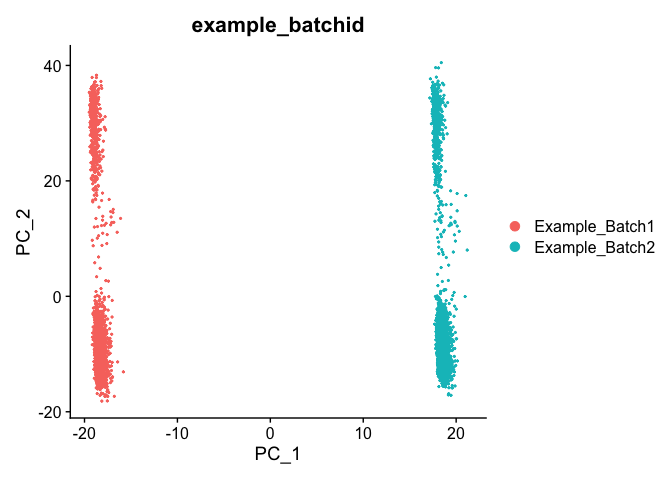
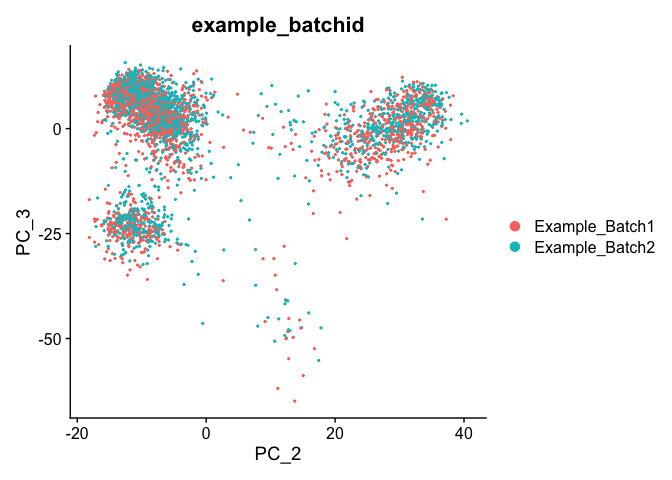
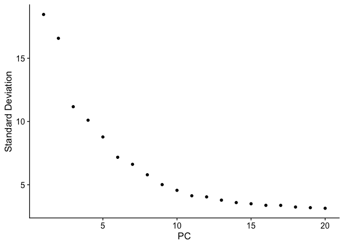
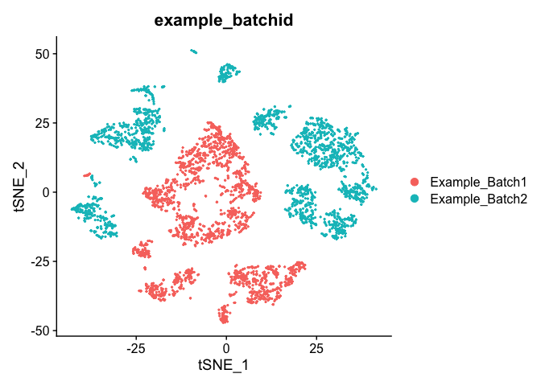
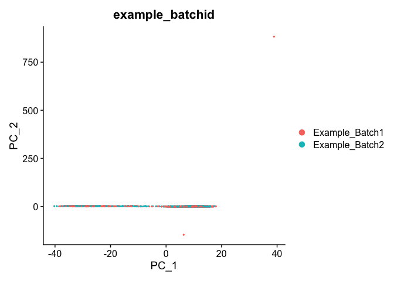
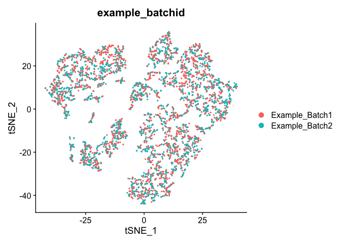

Last Updated: March 24 2021, 11am

# Part 3: Batch Correction Excercise


## Load libraries

```r
library(Seurat)
```

## Load the Seurat object from the prior excercise, and **create a batch effect**


```r
load(file="pre_sample_corrected.RData")
experiment.aggregate
```

<div class='r_output'> An object of class Seurat 
 36601 features across 4000 samples within 1 assay 
 Active assay: RNA (36601 features, 3783 variable features)
</div>
```r
experiment.test <- experiment.aggregate
VariableFeatures(experiment.test) <- rownames(experiment.test)
set.seed(12345)


samplename = experiment.aggregate$orig.ident
rand.cells <- sample(1:ncol(experiment.test), 2000,replace = F)
batchid = rep("Example_Batch1",length(samplename))
batchid[rand.cells] = "Example_Batch2"
names(batchid) = colnames(experiment.aggregate)

experiment.test <- AddMetaData(
  object = experiment.test,
  metadata = batchid,
  col.name = "example_batchid")

table(experiment.test$example_batchid)
```

<div class='r_output'> 
 Example_Batch1 Example_Batch2 
           2000           2000
</div>
```r
mat <- as.matrix(GetAssayData(experiment.test, slot="data"))

rand.genes <- sample(VariableFeatures(experiment.test), 500,replace = F)

mat[rand.genes,experiment.test$example_batchid=="Example_Batch2"] <- mat[rand.genes,experiment.test$example_batchid=="Example_Batch2"] + 0.22
experiment.test = SetAssayData(experiment.test, slot="data", new.data= mat )
rm(mat)
```

## Exploring Batch effects, none, Seurat [vars.to.regress]

First lets view the data without any corrections

## PCA in prep for tSNE

ScaleData - Scales and centers genes in the dataset.

```r
?ScaleData
```


```r
experiment.test.noc <- ScaleData(object = experiment.test)
```

### Run PCA

```r
experiment.test.noc <- RunPCA(object = experiment.test.noc)
DimPlot(object = experiment.test.noc, group.by = "example_batchid", reduction = "pca")
```



```r
DimPlot(object = experiment.test.noc, group.by = "example_batchid", dims = c(2,3), reduction = "pca")
```



PCA Elbow plot to determine how many principal components to use in downstream analyses.  Components after the "elbow" in the plot generally explain little additional variability in the data.


```r
ElbowPlot(experiment.test.noc)
```

<!-- -->

We use 10 components in downstream analyses. Using more components more closely approximates the full data set but increases run time.

### TSNE Plot

```r
pcs.use <- 10
experiment.test.noc <- RunTSNE(object = experiment.test.noc, dims = 1:pcs.use)
DimPlot(object = experiment.test.noc,  group.by = "example_batchid")
```



## Correct for sample to sample differences (seurat)

Use vars.to.regress to correct for the sample to sample differences and percent mitochondria

```r
experiment.test.regress <- ScaleData(object = experiment.test,
                    vars.to.regress = c("example_batchid"), model.use = "linear")

experiment.test.regress <- RunPCA(object =experiment.test.regress,features=rownames(experiment.test.noc))

DimPlot(object = experiment.test.regress, group.by = "example_batchid", reduction = "pca")
```



### Corrected TSNE Plot

```r
experiment.test.regress <- RunTSNE(object = experiment.test.regress, dims.use = 1:50)
DimPlot(object = experiment.test.regress, group.by = "example_batchid", reduction = "tsne")
```



#### Question(s)

1. Try a couple of PCA cutoffs (low and high) and compare the TSNE plots from the different methods.  Do they look meaningfully different?

### Excercise

Now go back to the original data without having been modified and see if a "batch effect" exists between the two actual batches

## Get the next Rmd file

```r
download.file("https://raw.githubusercontent.com/ucdavis-bioinformatics-training/2021-August-Single-Cell-RNA-Seq-Analysis/master/data_analysis/scRNA_Workshop-PART4.Rmd", "scRNA_Workshop-PART4.Rmd")
```

## Session Information

```r
sessionInfo()
```

<div class='r_output'> R version 4.0.3 (2020-10-10)
 Platform: x86_64-apple-darwin17.0 (64-bit)
 Running under: macOS Big Sur 10.16
 
 Matrix products: default
 BLAS:   /Library/Frameworks/R.framework/Versions/4.0/Resources/lib/libRblas.dylib
 LAPACK: /Library/Frameworks/R.framework/Versions/4.0/Resources/lib/libRlapack.dylib
 
 locale:
 [1] en_US.UTF-8/en_US.UTF-8/en_US.UTF-8/C/en_US.UTF-8/en_US.UTF-8
 
 attached base packages:
 [1] stats     graphics  grDevices utils     datasets  methods   base     
 
 other attached packages:
 [1] SeuratObject_4.0.0 Seurat_4.0.1      
 
 loaded via a namespace (and not attached):
   [1] Rtsne_0.15            colorspace_2.0-0      deldir_0.2-10        
   [4] ellipsis_0.3.1        ggridges_0.5.3        spatstat.data_2.1-0  
   [7] leiden_0.3.7          listenv_0.8.0         farver_2.1.0         
  [10] ggrepel_0.9.1         fansi_0.4.2           codetools_0.2-18     
  [13] splines_4.0.3         knitr_1.31            polyclip_1.10-0      
  [16] jsonlite_1.7.2        ica_1.0-2             cluster_2.1.1        
  [19] png_0.1-7             uwot_0.1.10           shiny_1.6.0          
  [22] sctransform_0.3.2     spatstat.sparse_2.0-0 compiler_4.0.3       
  [25] httr_1.4.2            assertthat_0.2.1      Matrix_1.3-2         
  [28] fastmap_1.1.0         lazyeval_0.2.2        later_1.1.0.1        
  [31] htmltools_0.5.1.1     tools_4.0.3           igraph_1.2.6         
  [34] gtable_0.3.0          glue_1.4.2            RANN_2.6.1           
  [37] reshape2_1.4.4        dplyr_1.0.5           Rcpp_1.0.6           
  [40] scattermore_0.7       jquerylib_0.1.3       vctrs_0.3.6          
  [43] nlme_3.1-152          lmtest_0.9-38         xfun_0.22            
  [46] stringr_1.4.0         globals_0.14.0        mime_0.10            
  [49] miniUI_0.1.1.1        lifecycle_1.0.0       irlba_2.3.3          
  [52] goftest_1.2-2         future_1.21.0         MASS_7.3-53.1        
  [55] zoo_1.8-9             scales_1.1.1          spatstat.core_2.0-0  
  [58] promises_1.2.0.1      spatstat.utils_2.1-0  parallel_4.0.3       
  [61] RColorBrewer_1.1-2    yaml_2.2.1            reticulate_1.18      
  [64] pbapply_1.4-3         gridExtra_2.3         ggplot2_3.3.3        
  [67] sass_0.3.1            rpart_4.1-15          stringi_1.5.3        
  [70] highr_0.8             rlang_0.4.10          pkgconfig_2.0.3      
  [73] matrixStats_0.58.0    evaluate_0.14         lattice_0.20-41      
  [76] ROCR_1.0-11           purrr_0.3.4           tensor_1.5           
  [79] patchwork_1.1.1       htmlwidgets_1.5.3     labeling_0.4.2       
  [82] cowplot_1.1.1         tidyselect_1.1.0      parallelly_1.24.0    
  [85] RcppAnnoy_0.0.18      plyr_1.8.6            magrittr_2.0.1       
  [88] R6_2.5.0              generics_0.1.0        DBI_1.1.1            
  [91] pillar_1.5.1          mgcv_1.8-34           fitdistrplus_1.1-3   
  [94] survival_3.2-10       abind_1.4-5           tibble_3.1.0         
  [97] future.apply_1.7.0    crayon_1.4.1          KernSmooth_2.23-18   
 [100] utf8_1.2.1            spatstat.geom_2.0-1   plotly_4.9.3         
 [103] rmarkdown_2.7         grid_4.0.3            data.table_1.14.0    
 [106] digest_0.6.27         xtable_1.8-4          tidyr_1.1.3          
 [109] httpuv_1.5.5          munsell_0.5.0         viridisLite_0.3.0    
 [112] bslib_0.2.4
</div>