Last Updated: March 24 2021, 5pm

# Part 5: 

## Load libraries

```r
library(Seurat)
library(ggplot2)
library(dplyr)
```

## Load the Seurat object

```r
load(file="pca_sample_corrected.RData")
experiment.aggregate
```

```
## An object of class Seurat 
## 36601 features across 4000 samples within 1 assay 
## Active assay: RNA (36601 features, 3783 variable features)
##  1 dimensional reduction calculated: pca
```


## So how many features should we use? Use too few and your leaving out interesting variation that may define cell types, use too many and you add in noise? maybe?

Lets choose the first 50, based on our prior part.


```r
use.pcs = 1:50
```

## Identifying clusters

Seurat implements an graph-based clustering approach. Distances between the cells are calculated based on previously identified PCs. 

The default method for identifying k-nearest neighbors has been changed in V4 to [annoy](https://github.com/spotify/annoy) ("Approximate Nearest Neighbors Oh Yeah!). This is an approximate nearest-neighbor approach that is widely used for high-dimensional analysis in many fields, including single-cell analysis. Extensive community benchmarking has shown that annoy substantially improves the speed and memory requirements of neighbor discovery, with negligible impact to downstream results. 


Seurat prior approach was heavily inspired by recent manuscripts which applied graph-based clustering approaches to scRNAseq data. Briefly, Seurat identified clusters of cells by a shared nearest neighbor (SNN) modularity optimization based clustering algorithm. First calculate k-nearest neighbors (KNN) and construct the SNN graph. Then optimize the modularity function to determine clusters. For a full description of the algorithms, see Waltman and van Eck (2013) The European Physical Journal B. You can switch back to using the previous default setting using nn.method="rann".


The FindClusters function implements the neighbor based clustering procedure, and contains a resolution parameter that sets the granularity of the downstream clustering, with increased values leading to a greater number of clusters. I tend to like to perform a series of resolutions, investigate and choose.


```r
?FindNeighbors
```


```r
experiment.aggregate <- FindNeighbors(experiment.aggregate, reduction="pca", dims = use.pcs)

experiment.aggregate <- FindClusters(
    object = experiment.aggregate,
    resolution = seq(0.25,4,0.5),
    verbose = FALSE
)
```


Seurat add the clustering information to the metadata beginning with RNA_snn_res. followed by the resolution


```r
head(experiment.aggregate[[]])
```

```
##                        orig.ident nCount_RNA nFeature_RNA batchid percent.mito
## CCGTTCAAGGTGACCA-PBMC2      PBMC2       1533         1004  Batch1     4.044357
## ATTGGTGTCGGTTCGG-PBMC2      PBMC2       1225          834  Batch1     7.673469
## GTAGGCCTCTATCCTA-PBMC2      PBMC2       1109          806  Batch1     4.418395
## CATTATCCAGGCAGTA-PBMC2      PBMC2       1949         1226  Batch1     7.439713
## CTGGTCTTCCAAATGC-PBMC2      PBMC2       3074         1303  Batch1     2.374756
## AGCTTGAGTTGTGGAG-PBMC2      PBMC2       1028          748  Batch1     3.599222
##                             S.Score   G2M.Score Phase old.ident
## CCGTTCAAGGTGACCA-PBMC2 -0.009757111  0.05114394   G2M     PBMC2
## ATTGGTGTCGGTTCGG-PBMC2 -0.006619531  0.02301644   G2M     PBMC2
## GTAGGCCTCTATCCTA-PBMC2  0.019239276 -0.02686039     S     PBMC2
## CATTATCCAGGCAGTA-PBMC2 -0.077384425  0.04775564   G2M     PBMC2
## CTGGTCTTCCAAATGC-PBMC2  0.032593746 -0.01541937     S     PBMC2
## AGCTTGAGTTGTGGAG-PBMC2 -0.051954726 -0.01295370    G1     PBMC2
##                        RNA_snn_res.0.25 RNA_snn_res.0.75 RNA_snn_res.1.25
## CCGTTCAAGGTGACCA-PBMC2                2                9                9
## ATTGGTGTCGGTTCGG-PBMC2                4                3                3
## GTAGGCCTCTATCCTA-PBMC2                5                6                7
## CATTATCCAGGCAGTA-PBMC2                2                9                9
## CTGGTCTTCCAAATGC-PBMC2                6                5                6
## AGCTTGAGTTGTGGAG-PBMC2                5                6                7
##                        RNA_snn_res.1.75 RNA_snn_res.2.25 RNA_snn_res.2.75
## CCGTTCAAGGTGACCA-PBMC2               11               13               12
## ATTGGTGTCGGTTCGG-PBMC2                3                2               20
## GTAGGCCTCTATCCTA-PBMC2                7                8                8
## CATTATCCAGGCAGTA-PBMC2               11               13               12
## CTGGTCTTCCAAATGC-PBMC2                6                6                5
## AGCTTGAGTTGTGGAG-PBMC2                7                8                8
##                        RNA_snn_res.3.25 RNA_snn_res.3.75 seurat_clusters
## CCGTTCAAGGTGACCA-PBMC2               12               11              11
## ATTGGTGTCGGTTCGG-PBMC2               23               25              25
## GTAGGCCTCTATCCTA-PBMC2                8                8               8
## CATTATCCAGGCAGTA-PBMC2               12               11              11
## CTGGTCTTCCAAATGC-PBMC2                5                4               4
## AGCTTGAGTTGTGGAG-PBMC2                8                8               8
```


Lets first investigate how many clusters each resolution produces and set it to the smallest resolutions of 0.5 (fewest clusters).


```r
sapply(grep("res",colnames(experiment.aggregate@meta.data),value = TRUE),
       function(x) length(unique(experiment.aggregate@meta.data[,x])))
```

```
## RNA_snn_res.0.25 RNA_snn_res.0.75 RNA_snn_res.1.25 RNA_snn_res.1.75 
##                9               15               16               19 
## RNA_snn_res.2.25 RNA_snn_res.2.75 RNA_snn_res.3.25 RNA_snn_res.3.75 
##               21               24               26               29
```

### Plot TSNE coloring for each resolution

tSNE dimensionality reduction plots are then used to visualize clustering results. As input to the tSNE, you should use the same PCs as input to the clustering analysis.


```r
experiment.aggregate <- RunTSNE(
  object = experiment.aggregate,
  reduction.use = "pca",
  dims = use.pcs,
  do.fast = TRUE)
```


```r
DimPlot(object = experiment.aggregate, group.by=grep("res",colnames(experiment.aggregate@meta.data),value = TRUE)[1:4], ncol=2 , pt.size=3.0, reduction = "tsne", label = T)
```

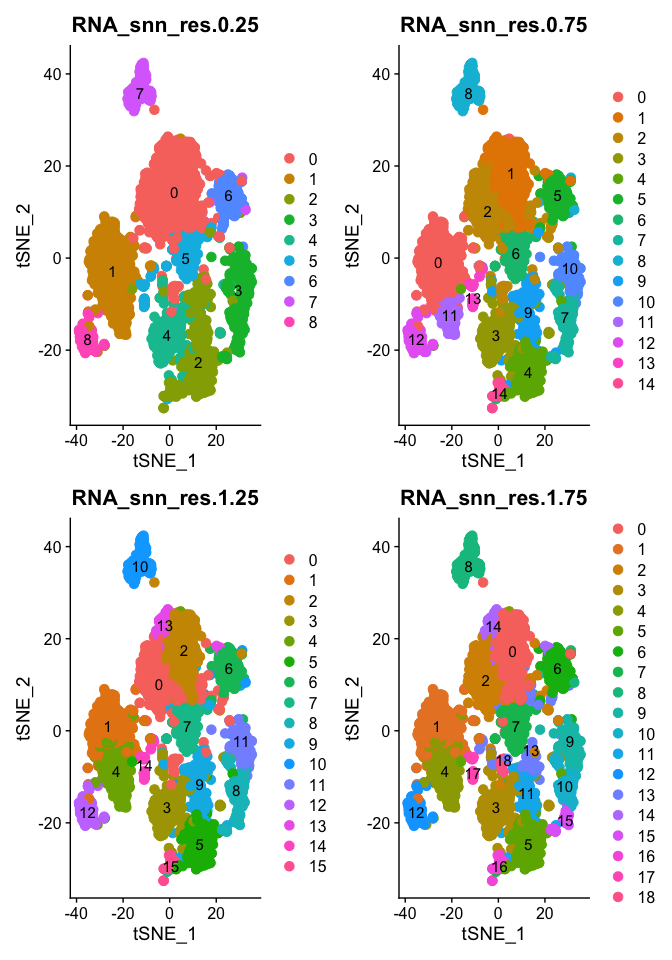<!-- -->


```r
DimPlot(object = experiment.aggregate, group.by=grep("res",colnames(experiment.aggregate@meta.data),value = TRUE)[5:8], ncol=2 , pt.size=3.0, reduction = "tsne", label = T)
```

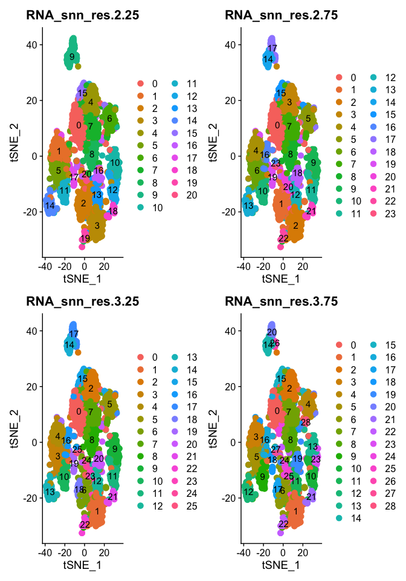<!-- -->

1. Try exploring different PCS, so first 5, 15, 25, we used 50, what about 100? How does the clustering change?

Once complete go back to 1:50

### Choosing a resolution

Lets set the default identity to a resolution of 0.25 and produce a table of cluster to sample assignments.

```r
Idents(experiment.aggregate) <- "RNA_snn_res.1.25"
table(Idents(experiment.aggregate),experiment.aggregate$orig.ident)
```

```
##     
##      PBMC2 PBMC3 T021PBMC T022PBMC
##   0     19    19      341       90
##   1     43   403        3        7
##   2      9     0       15      431
##   3      7    15      284       49
##   4     15   315       10        5
##   5      7     2       76      219
##   6    247    13        2        0
##   7    203     2        0        6
##   8     12   179        2       13
##   9    150     6       30       18
##   10    73    10       92       29
##   11   171    12        1        0
##   12     0     0       37       99
##   13     6     0       87        5
##   14    33    24        2        3
##   15     5     0       18       26
```

Plot TSNE coloring by the slot 'ident' (default).

```r
DimPlot(object = experiment.aggregate, pt.size=0.5, reduction = "tsne", label = T)
```

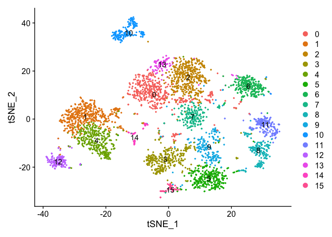<!-- -->


### uMAP dimensionality reduction plot.


```r
experiment.aggregate <- RunUMAP(
  object = experiment.aggregate,
  dims = use.pcs)
```

Plot uMap coloring by the slot 'ident' (default).

```r
DimPlot(object = experiment.aggregate, pt.size=0.5, reduction = "umap", label = T)
```

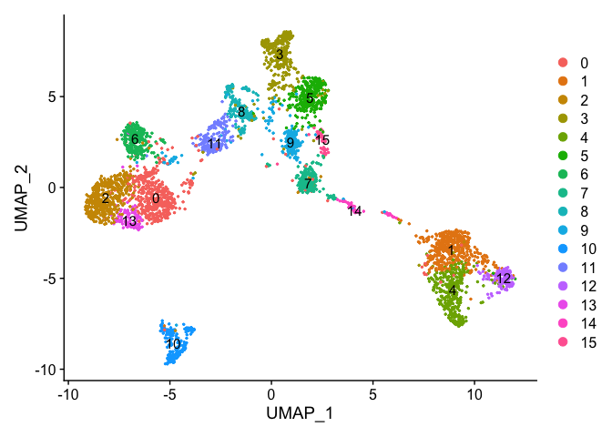<!-- -->

Catagorical data can be plotted using the DimPlot function.


TSNE plot by cell cycle

```r
DimPlot(object = experiment.aggregate, pt.size=0.5, group.by = "Phase", reduction = "umap" )
```

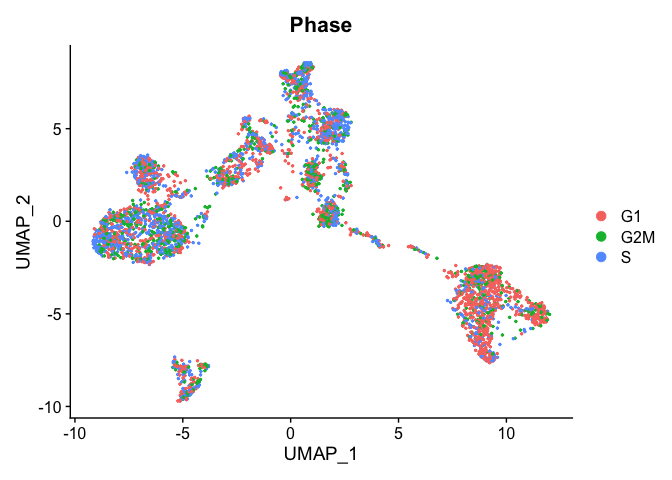<!-- -->

1. Try creating a table, of cluster x cell cycle

### Can use feature plot to plot our read valued metadata, like nUMI, Feature count, and percent Mito
FeaturePlot can be used to color cells with a 'feature', non categorical data, like number of UMIs

```r
FeaturePlot(experiment.aggregate, features = c('nCount_RNA'), pt.size=0.5)
```

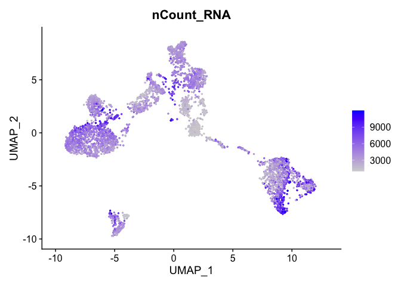<!-- -->
and number of genes present

```r
FeaturePlot(experiment.aggregate, features = c('nFeature_RNA'), pt.size=0.5)
```

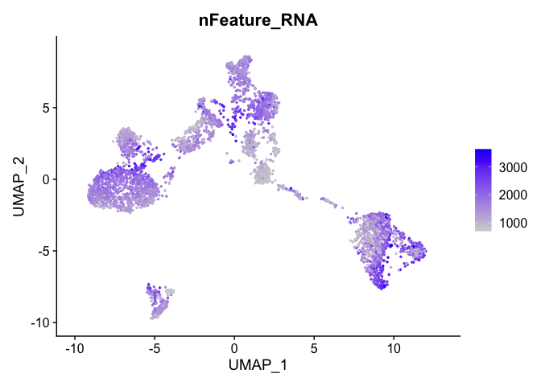<!-- -->

percent mitochondrial

```r
FeaturePlot(experiment.aggregate, features = c('percent.mito'), pt.size=0.5)
```

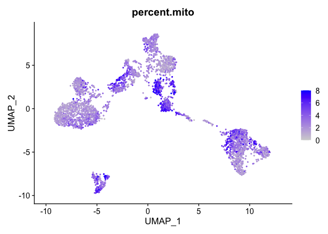<!-- -->

## Building a phylogenetic tree relating the 'average' cell from each group in default 'Ident' (currently "RNA_snn_res.0.25"). Tree is estimated based on a distance matrix constructed in either gene expression space or PCA space.


```r
Idents(experiment.aggregate) <- "RNA_snn_res.0.25"
experiment.aggregate <- BuildClusterTree(
  experiment.aggregate, dims = use.pcs)

PlotClusterTree(experiment.aggregate)
```

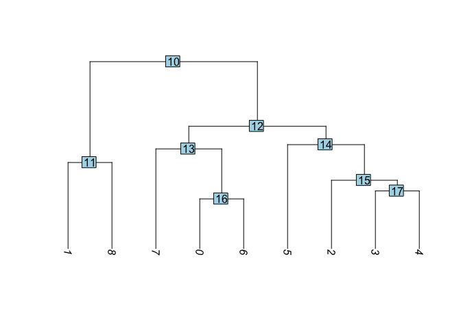<!-- -->
1. Create new trees of other data

Once complete go back to Res 0.25


```r
DimPlot(object = experiment.aggregate, pt.size=0.5, label = TRUE, reduction = "umap")
```

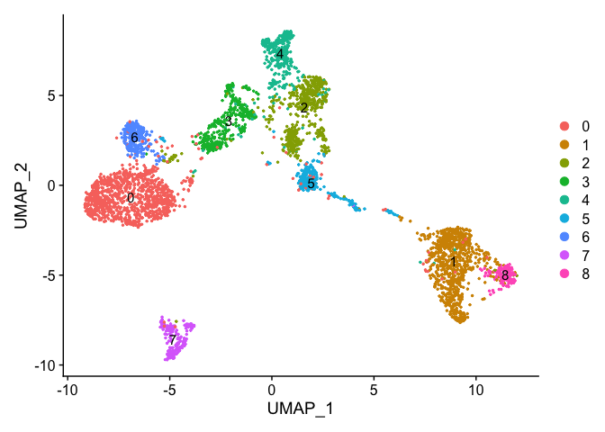<!-- -->

### Merging clusters

Merge Clustering results, so lets say clusters 3 and 7 are actually the same cell type (overlaps in the tsne, not as apparent in the umap) and we don't wish to separate them out as distinct clusters. Same with 4 and 5.


```r
experiment.merged = experiment.aggregate
Idents(experiment.merged) <- "RNA_snn_res.0.25"

experiment.merged <- RenameIdents(
  object = experiment.merged,
  '3' = '7', '4' = '5'
)

table(Idents(experiment.merged))
```

```
## 
##    7    5    0    1    2    6    8 
##  595  627 1024  803  552  265  134
```

```r
DimPlot(object = experiment.merged, pt.size=0.5, label = T, reduction = "umap")
```

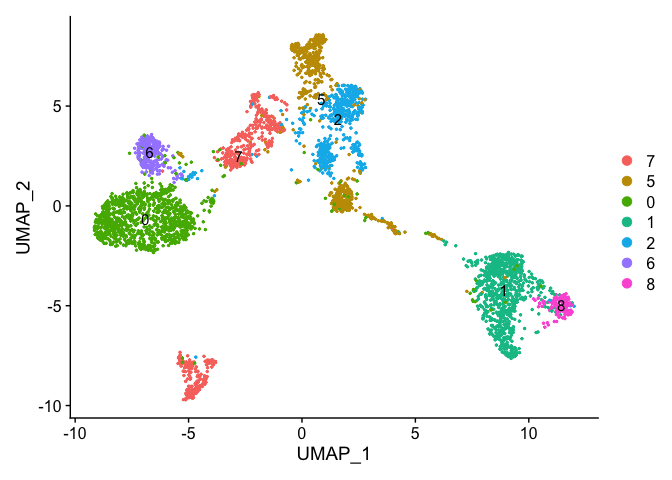<!-- -->

```r
VlnPlot(object = experiment.merged, features = "percent.mito", pt.size = 0.05)
```

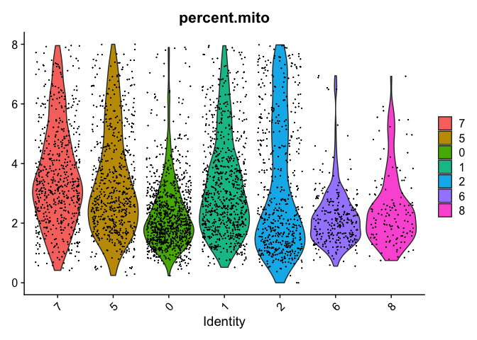<!-- -->

### Reording the clusters

In order to reorder the clusters for plotting purposes take a look at the levels of the Ident, which indicates the ordering, then relevel as desired.


```r
experiment.examples <- experiment.merged
levels(experiment.examples@active.ident)
```

```
## [1] "7" "5" "0" "1" "2" "6" "8"
```

```r
experiment.examples@active.ident <- relevel(experiment.examples@active.ident, "6")
levels(experiment.examples@active.ident)
```

```
## [1] "6" "7" "5" "0" "1" "2" "8"
```

```r
# now cluster 6 is the "first" factor

DimPlot(object = experiment.examples, pt.size=0.5, label = T, reduction = "umap")
```

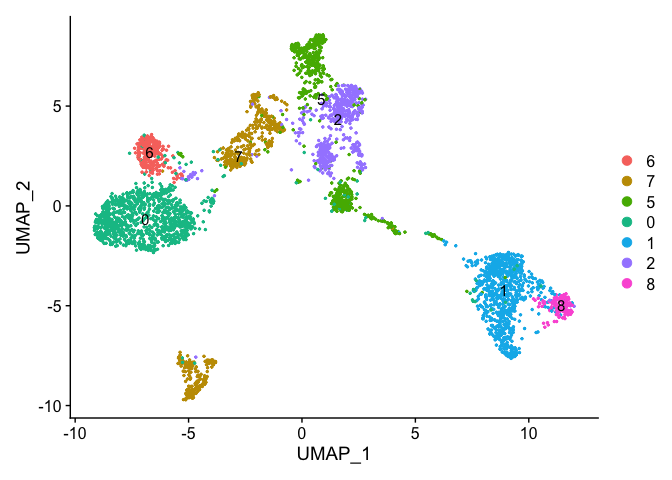<!-- -->

```r
VlnPlot(object = experiment.examples, features = "percent.mito", pt.size = 0.05)
```

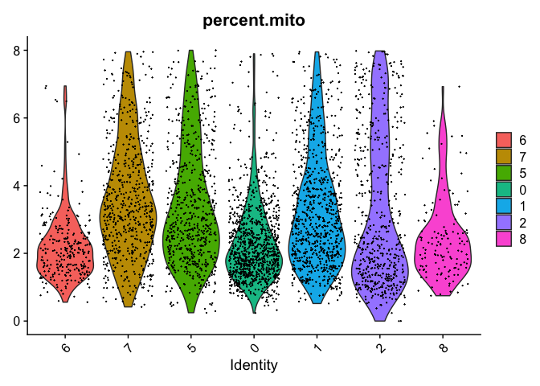<!-- -->


```r
# relevel all the factors to the order I want
Idents(experiment.examples) <- factor(experiment.examples@active.ident, levels=c("6","2","0","7","5","9","1","8"))
levels(experiment.examples@active.ident)
```

```
## [1] "6" "2" "0" "7" "5" "1" "8"
```

```r
DimPlot(object = experiment.examples, pt.size=0.5, label = T, reduction = "umap")
```

<!-- -->


### Re-assign clustering result (subclustering only cluster 0) to clustering for resolution 3.75  (@ reslution 0.25) [adding a R prefix]

```r
newIdent = as.character(Idents(experiment.examples))
newIdent[newIdent == '0'] = paste0("R",as.character(experiment.examples$RNA_snn_res.3.75[newIdent == '0']))

Idents(experiment.examples) <- as.factor(newIdent)
table(Idents(experiment.examples))
```

```
## 
##   1   2   5   6   7   8  R0 R13 R15 R16 R19  R2 R24 R28  R7 
## 803 552 627 265 595 134 337   1 111   4   4 297  41   3 226
```


```r
DimPlot(object = experiment.examples, pt.size=0.5, label = T, reduction = "umap")
```

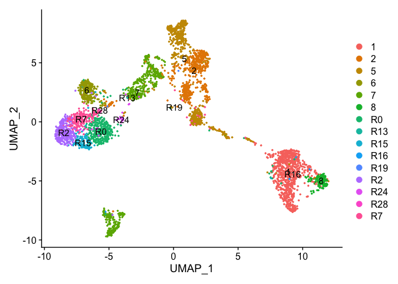<!-- -->

Plot UMAP  coloring by the slot 'orig.ident' (sample names) with alpha colors turned on. A pretty picture

```r
DimPlot(object = experiment.aggregate, group.by="orig.ident", pt.size=0.5, reduction = "umap" )
```

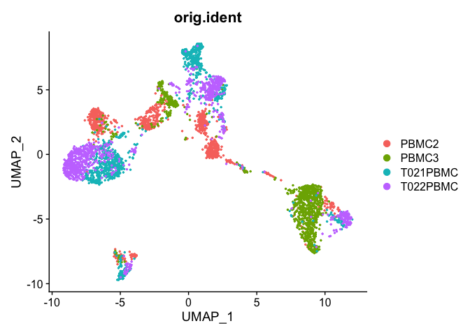<!-- -->


```r
## Pretty umap using alpha
alpha.use <- 2/5
p <- DimPlot(object = experiment.aggregate, group.by="orig.ident", pt.size=0.5, reduction = "umap")
p$layers[[1]]$mapping$alpha <- alpha.use
p + scale_alpha_continuous(range = alpha.use, guide = F)
```

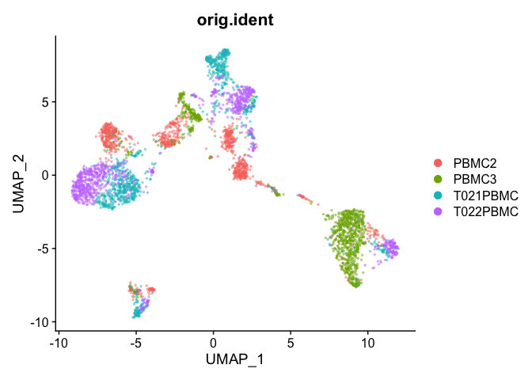<!-- -->

Removing cells assigned to clusters from a plot, So here plot all clusters but cluster 6 (contaminant?)

```r
# create a new tmp object with those removed
experiment.aggregate.tmp <- experiment.aggregate[,-which(Idents(experiment.aggregate) %in% c("6"))]

dim(experiment.aggregate)
```

```
## [1] 36601  4000
```

```r
dim(experiment.aggregate.tmp)
```

```
## [1] 36601  3735
```


```r
DimPlot(object = experiment.aggregate.tmp, pt.size=0.5, reduction = "umap", label = T)
```

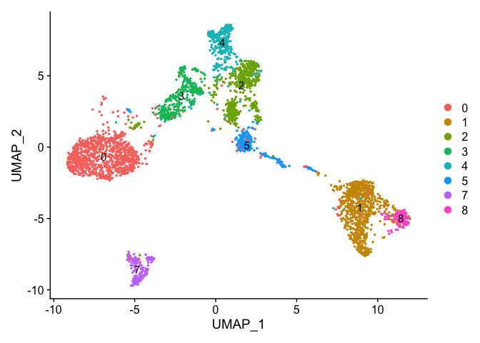<!-- -->

## Identifying Marker Genes

Seurat can help you find markers that define clusters via differential expression.

`FindMarkers` identifies markers for a cluster relative to all other clusters.

`FindAllMarkers` does so for all clusters

`FindAllMarkersNode` defines all markers that split a Node from the cluster tree


```r
?FindMarkers
```


```r
markers = FindMarkers(experiment.aggregate, ident.1=c(3,7), ident.2 = c(4,5))

head(markers)
```

```
##               p_val avg_log2FC pct.1 pct.2     p_val_adj
## RPL13 6.509849e-128   1.266628 0.993 0.941 2.382670e-123
## RPS5  5.564534e-107   1.375955 0.966 0.740 2.036675e-102
## RPS19 8.747659e-104   1.214465 0.985 0.860  3.201731e-99
## RPS8  5.925264e-102   1.128725 0.993 0.901  2.168706e-97
## RPL29  3.151857e-93   1.075348 0.982 0.829  1.153611e-88
## RPS18  3.693614e-93   1.170980 0.985 0.871  1.351900e-88
```

```r
dim(markers)
```

```
## [1] 1509    5
```

```r
table(markers$avg_log2FC > 0)
```

```
## 
## FALSE  TRUE 
##  1002   507
```

```r
table(markers$p_val_adj < 0.05 & markers$avg_log2FC > 0)
```

```
## 
## FALSE  TRUE 
##  1130   379
```


pct.1 and pct.2 are the proportion of cells with expression above 0 in ident.1 and ident.2 respectively. p_val is the raw p_value associated with the differntial expression test with adjusted value in p_val_adj. avg_logFC is the average log fold change difference between the two groups.

avg_diff (lines 130, 193 and) appears to be the difference in log(x = mean(x = exp(x = x) - 1) + 1) between groups.  It doesn’t seem like this should work out to be the signed ratio of pct.1 to pct.2 so I must be missing something.  It doesn’t seem to be related at all to how the p-values are calculated so maybe it doesn’t matter so much, and the sign is probably going to be pretty robust to how expression is measured.

Can use a violin plot to visualize the expression pattern of some markers

```r
VlnPlot(object = experiment.aggregate, features = rownames(markers)[1:2], pt.size = 0.05)
```

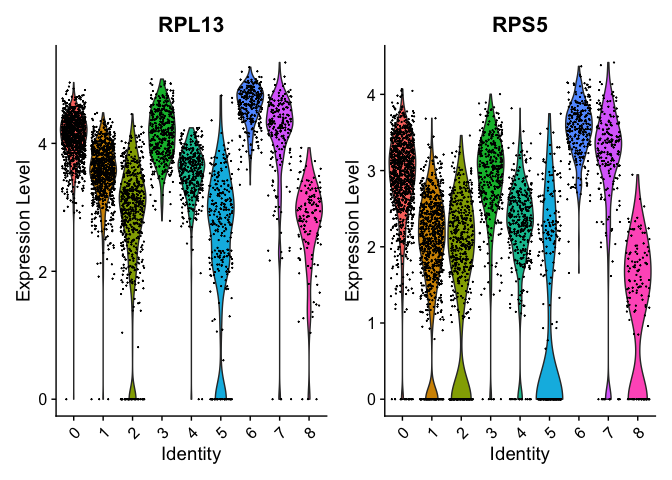<!-- -->

Or a feature plot

```r
FeaturePlot(
    experiment.aggregate,
    "KLRD1",
    cols = c("lightgrey", "blue"),
    ncol = 2
)
```

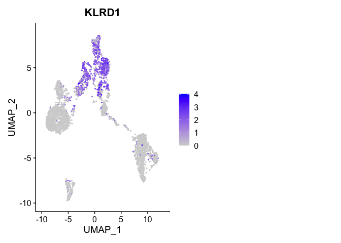<!-- -->

FindAllMarkers can be used to automate the process across all genes.


```r
markers_all <- FindAllMarkers(
    object = experiment.merged,
    only.pos = TRUE,
    min.pct = 0.25,
    thresh.use = 0.25
)
dim(markers_all)
```

```
## [1] 4031    7
```

```r
head(markers_all)
```

```
##                   p_val avg_log2FC pct.1 pct.2     p_val_adj cluster      gene
## MS4A1     7.868239e-202   2.460640 0.333 0.014 2.879854e-197       7     MS4A1
## LINC00926 1.243988e-201   1.881382 0.292 0.005 4.553122e-197       7 LINC00926
## CD79A     2.998365e-173   2.941748 0.336 0.024 1.097432e-168       7     CD79A
## BANK1     2.474993e-155   1.334570 0.255 0.009 9.058720e-151       7     BANK1
## IGHM      1.796692e-143   1.835100 0.289 0.021 6.576072e-139       7      IGHM
## AFF3      6.026634e-129   1.291855 0.257 0.018 2.205808e-124       7      AFF3
```

```r
table(table(markers_all$gene))
```

```
## 
##    1    2    3    4 
## 1371 1049  178    7
```

```r
markers_all_single <- markers_all[markers_all$gene %in% names(table(markers_all$gene))[table(markers_all$gene) == 1],]

dim(markers_all_single)
```

```
## [1] 1371    7
```

```r
table(table(markers_all_single$gene))
```

```
## 
##    1 
## 1371
```

```r
table(markers_all_single$cluster)
```

```
## 
##   7   5   0   1   2   6   8 
##  45  24 151 325 520  70 236
```

```r
head(markers_all_single)
```

```
##                   p_val avg_log2FC pct.1 pct.2     p_val_adj cluster      gene
## MS4A1     7.868239e-202   2.460640 0.333 0.014 2.879854e-197       7     MS4A1
## LINC00926 1.243988e-201   1.881382 0.292 0.005 4.553122e-197       7 LINC00926
## CD79A     2.998365e-173   2.941748 0.336 0.024 1.097432e-168       7     CD79A
## BANK1     2.474993e-155   1.334570 0.255 0.009 9.058720e-151       7     BANK1
## IGHM      1.796692e-143   1.835100 0.289 0.021 6.576072e-139       7      IGHM
## AFF3      6.026634e-129   1.291855 0.257 0.018 2.205808e-124       7      AFF3
```

Plot a heatmap of genes by cluster for the top 10 marker genes per cluster

```r
top10 <- markers_all_single %>% group_by(cluster) %>% top_n(10, avg_log2FC)
DoHeatmap(
    object = experiment.merged,
    features = top10$gene
)
```

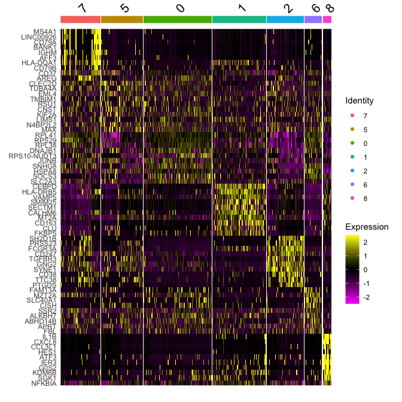<!-- -->


```r
# Get expression of genes for cells in and out of each cluster
getGeneClusterMeans <- function(gene, cluster){
  x <- GetAssayData(experiment.merged)[gene,]
  m <- tapply(x, ifelse(Idents(experiment.merged) == cluster, 1, 0), mean)
  mean.in.cluster <- m[2]
  mean.out.of.cluster <- m[1]
  return(list(mean.in.cluster = mean.in.cluster, mean.out.of.cluster = mean.out.of.cluster))
}

## for sake of time only using first six (head)
means <- mapply(getGeneClusterMeans, head(markers_all[,"gene"]), head(markers_all[,"cluster"]))
means <- matrix(unlist(means), ncol = 2, byrow = T)

colnames(means) <- c("mean.in.cluster", "mean.out.of.cluster")
rownames(means) <- head(markers_all[,"gene"])
markers_all2 <- cbind(head(markers_all), means)
head(markers_all2)
```

```
##                   p_val avg_log2FC pct.1 pct.2     p_val_adj cluster      gene
## MS4A1     7.868239e-202   2.460640 0.333 0.014 2.879854e-197       7     MS4A1
## LINC00926 1.243988e-201   1.881382 0.292 0.005 4.553122e-197       7 LINC00926
## CD79A     2.998365e-173   2.941748 0.336 0.024 1.097432e-168       7     CD79A
## BANK1     2.474993e-155   1.334570 0.255 0.009 9.058720e-151       7     BANK1
## IGHM      1.796692e-143   1.835100 0.289 0.021 6.576072e-139       7      IGHM
## AFF3      6.026634e-129   1.291855 0.257 0.018 2.205808e-124       7      AFF3
##           mean.in.cluster mean.out.of.cluster
## MS4A1           0.8339190         0.020402330
## LINC00926       0.6112367         0.008039788
## CD79A           0.9998699         0.034222701
## BANK1           0.4698104         0.012849977
## IGHM            0.6230881         0.033921560
## AFF3            0.4629120         0.023382292
```

## Finishing up clusters.

At this point in time you should use the tree, markers, domain knowledge, and goals to finalize your clusters. This may mean adjusting PCA to use, mergers clusters together, choosing a new resolutions, etc. When finished you can further name it cluster by something more informative. Ex.

```r
experiment.clusters <- experiment.aggregate
experiment.clusters <- RenameIdents(
  object = experiment.clusters,
  '0' = 'cell_type_A',
  '1' = 'cell_type_B',
  '2' = 'cell_type_C'
)
# and so on

DimPlot(object = experiment.clusters, pt.size=0.5, label = T, reduction = "tsne")
```

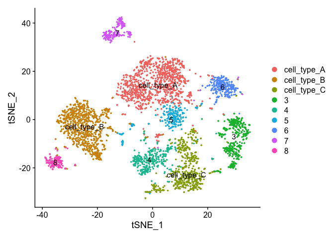<!-- -->

Right now our results ONLY exist in the Ident data object, lets save it to our metadata table so we don't accidentally loose it.

```r
experiment.merged$finalcluster <- Idents(experiment.merged)
head(experiment.merged[[]])
```

```
##                        orig.ident nCount_RNA nFeature_RNA batchid percent.mito
## CCGTTCAAGGTGACCA-PBMC2      PBMC2       1533         1004  Batch1     4.044357
## ATTGGTGTCGGTTCGG-PBMC2      PBMC2       1225          834  Batch1     7.673469
## GTAGGCCTCTATCCTA-PBMC2      PBMC2       1109          806  Batch1     4.418395
## CATTATCCAGGCAGTA-PBMC2      PBMC2       1949         1226  Batch1     7.439713
## CTGGTCTTCCAAATGC-PBMC2      PBMC2       3074         1303  Batch1     2.374756
## AGCTTGAGTTGTGGAG-PBMC2      PBMC2       1028          748  Batch1     3.599222
##                             S.Score   G2M.Score Phase old.ident
## CCGTTCAAGGTGACCA-PBMC2 -0.009757111  0.05114394   G2M     PBMC2
## ATTGGTGTCGGTTCGG-PBMC2 -0.006619531  0.02301644   G2M     PBMC2
## GTAGGCCTCTATCCTA-PBMC2  0.019239276 -0.02686039     S     PBMC2
## CATTATCCAGGCAGTA-PBMC2 -0.077384425  0.04775564   G2M     PBMC2
## CTGGTCTTCCAAATGC-PBMC2  0.032593746 -0.01541937     S     PBMC2
## AGCTTGAGTTGTGGAG-PBMC2 -0.051954726 -0.01295370    G1     PBMC2
##                        RNA_snn_res.0.25 RNA_snn_res.0.75 RNA_snn_res.1.25
## CCGTTCAAGGTGACCA-PBMC2                2                9                9
## ATTGGTGTCGGTTCGG-PBMC2                4                3                3
## GTAGGCCTCTATCCTA-PBMC2                5                6                7
## CATTATCCAGGCAGTA-PBMC2                2                9                9
## CTGGTCTTCCAAATGC-PBMC2                6                5                6
## AGCTTGAGTTGTGGAG-PBMC2                5                6                7
##                        RNA_snn_res.1.75 RNA_snn_res.2.25 RNA_snn_res.2.75
## CCGTTCAAGGTGACCA-PBMC2               11               13               12
## ATTGGTGTCGGTTCGG-PBMC2                3                2               20
## GTAGGCCTCTATCCTA-PBMC2                7                8                8
## CATTATCCAGGCAGTA-PBMC2               11               13               12
## CTGGTCTTCCAAATGC-PBMC2                6                6                5
## AGCTTGAGTTGTGGAG-PBMC2                7                8                8
##                        RNA_snn_res.3.25 RNA_snn_res.3.75 seurat_clusters
## CCGTTCAAGGTGACCA-PBMC2               12               11              11
## ATTGGTGTCGGTTCGG-PBMC2               23               25              25
## GTAGGCCTCTATCCTA-PBMC2                8                8               8
## CATTATCCAGGCAGTA-PBMC2               12               11              11
## CTGGTCTTCCAAATGC-PBMC2                5                4               4
## AGCTTGAGTTGTGGAG-PBMC2                8                8               8
##                        finalcluster
## CCGTTCAAGGTGACCA-PBMC2            2
## ATTGGTGTCGGTTCGG-PBMC2            5
## GTAGGCCTCTATCCTA-PBMC2            5
## CATTATCCAGGCAGTA-PBMC2            2
## CTGGTCTTCCAAATGC-PBMC2            6
## AGCTTGAGTTGTGGAG-PBMC2            5
```

## Subsetting samples and plotting

If you want to look at the representation of just one sample, or sets of samples

```r
experiment.sample2 <- subset(experiment.merged, orig.ident == "T021PBMC")

DimPlot(object = experiment.sample2, group.by = "RNA_snn_res.0.25", pt.size=0.5, label = TRUE, reduction = "tsne")
```

<!-- -->

```r
experiment.batch1 <- subset(experiment.merged, batchid == "Batch1")

DimPlot(object = experiment.batch1, group.by = "RNA_snn_res.0.25", pt.size=0.5, label = TRUE, reduction = "tsne")
```

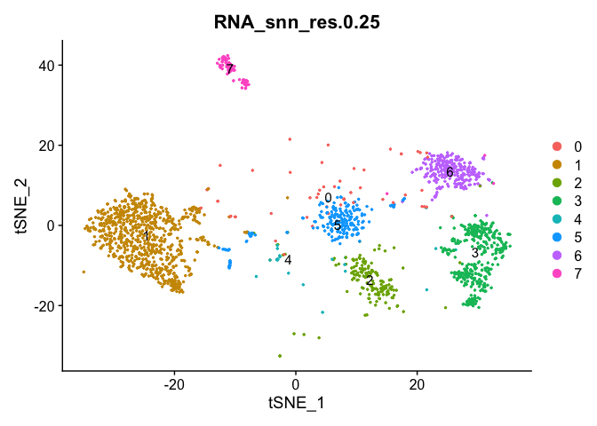<!-- -->

### Adding in a new metadata column representing samples within clusters. So differential expression of PBMC2 vs PBMC3 within cluster 7


```r
experiment.merged$samplecluster = paste(experiment.merged$orig.ident,experiment.merged$finalcluster,sep = '-')

# set the identity to the new variable
Idents(experiment.merged) <- "samplecluster"

markers.comp <- FindMarkers(experiment.merged, ident.1 = c("PBMC2-7","PBMC3-7"), ident.2= "PBMC2-5")

head(markers.comp)
```

```
##               p_val avg_log2FC pct.1 pct.2    p_val_adj
## RPS19  4.133527e-86   2.281703 0.983 0.725 1.512912e-81
## RPL28  2.638843e-85   2.088881 0.987 0.749 9.658429e-81
## RPS3   4.573010e-83   1.877041 0.993 0.814 1.673767e-78
## RPS27  5.062436e-83   1.947372 0.991 0.870 1.852902e-78
## RPL13  6.204595e-82   1.776009 0.991 0.931 2.270944e-77
## TMSB10 2.145713e-80   1.909817 0.985 0.846 7.853524e-76
```

```r
experiment.subset <- subset(experiment.merged, samplecluster %in%  c( "PBMC2-7", "PBMC3-7" ))
DoHeatmap(experiment.subset, features = head(rownames(markers.comp),20))
```

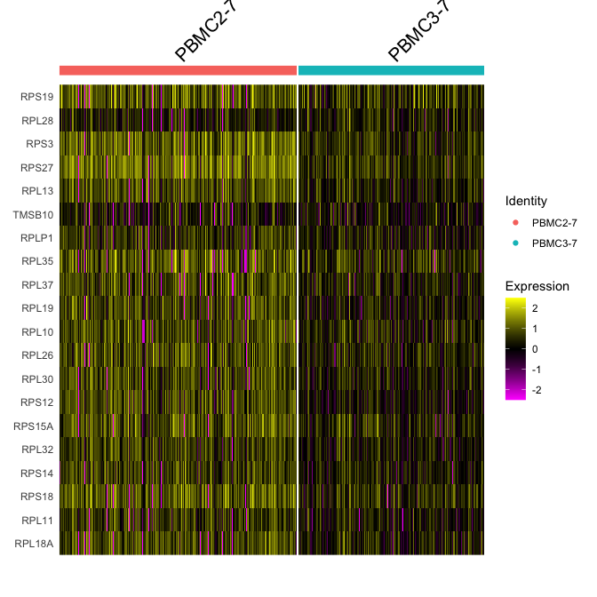<!-- -->


```r
Idents(experiment.merged) <- "finalcluster"
```

And last lets save all the objects in our session.

```r
save(list=ls(), file="clusters_seurat_object.RData")
```

## Get the next Rmd file

```r
download.file("https://raw.githubusercontent.com/ucdavis-bioinformatics-training/2021-August-Single-Cell-RNA-Seq-Analysis/master/data_analysis/scRNA_Workshop-PART6.Rmd", "scRNA_Workshop-PART6.Rmd")
```

## Session Information

```r
sessionInfo()
```

```
## R version 4.0.3 (2020-10-10)
## Platform: x86_64-apple-darwin17.0 (64-bit)
## Running under: macOS Big Sur 10.16
## 
## Matrix products: default
## BLAS:   /Library/Frameworks/R.framework/Versions/4.0/Resources/lib/libRblas.dylib
## LAPACK: /Library/Frameworks/R.framework/Versions/4.0/Resources/lib/libRlapack.dylib
## 
## locale:
## [1] en_US.UTF-8/en_US.UTF-8/en_US.UTF-8/C/en_US.UTF-8/en_US.UTF-8
## 
## attached base packages:
## [1] stats     graphics  grDevices utils     datasets  methods   base     
## 
## other attached packages:
## [1] dplyr_1.0.5        ggplot2_3.3.3      SeuratObject_4.0.0 Seurat_4.0.1      
## 
## loaded via a namespace (and not attached):
##   [1] Rtsne_0.15            colorspace_2.0-0      deldir_0.2-10        
##   [4] ellipsis_0.3.1        ggridges_0.5.3        spatstat.data_2.1-0  
##   [7] leiden_0.3.7          listenv_0.8.0         farver_2.1.0         
##  [10] ggrepel_0.9.1         RSpectra_0.16-0       fansi_0.4.2          
##  [13] codetools_0.2-18      splines_4.0.3         knitr_1.31           
##  [16] polyclip_1.10-0       jsonlite_1.7.2        ica_1.0-2            
##  [19] cluster_2.1.1         png_0.1-7             uwot_0.1.10          
##  [22] shiny_1.6.0           sctransform_0.3.2     spatstat.sparse_2.0-0
##  [25] compiler_4.0.3        httr_1.4.2            assertthat_0.2.1     
##  [28] Matrix_1.3-2          fastmap_1.1.0         lazyeval_0.2.2       
##  [31] limma_3.44.3          later_1.1.0.1         htmltools_0.5.1.1    
##  [34] tools_4.0.3           igraph_1.2.6          gtable_0.3.0         
##  [37] glue_1.4.2            RANN_2.6.1            reshape2_1.4.4       
##  [40] Rcpp_1.0.6            scattermore_0.7       jquerylib_0.1.3      
##  [43] vctrs_0.3.6           ape_5.4-1             nlme_3.1-152         
##  [46] lmtest_0.9-38         xfun_0.22             stringr_1.4.0        
##  [49] globals_0.14.0        mime_0.10             miniUI_0.1.1.1       
##  [52] lifecycle_1.0.0       irlba_2.3.3           goftest_1.2-2        
##  [55] future_1.21.0         MASS_7.3-53.1         zoo_1.8-9            
##  [58] scales_1.1.1          spatstat.core_2.0-0   promises_1.2.0.1     
##  [61] spatstat.utils_2.1-0  parallel_4.0.3        RColorBrewer_1.1-2   
##  [64] yaml_2.2.1            reticulate_1.18       pbapply_1.4-3        
##  [67] gridExtra_2.3         sass_0.3.1            rpart_4.1-15         
##  [70] stringi_1.5.3         highr_0.8             rlang_0.4.10         
##  [73] pkgconfig_2.0.3       matrixStats_0.58.0    evaluate_0.14        
##  [76] lattice_0.20-41       ROCR_1.0-11           purrr_0.3.4          
##  [79] tensor_1.5            patchwork_1.1.1       htmlwidgets_1.5.3    
##  [82] labeling_0.4.2        cowplot_1.1.1         tidyselect_1.1.0     
##  [85] parallelly_1.24.0     RcppAnnoy_0.0.18      plyr_1.8.6           
##  [88] magrittr_2.0.1        R6_2.5.0              generics_0.1.0       
##  [91] DBI_1.1.1             pillar_1.5.1          withr_2.4.1          
##  [94] mgcv_1.8-34           fitdistrplus_1.1-3    survival_3.2-10      
##  [97] abind_1.4-5           tibble_3.1.0          future.apply_1.7.0   
## [100] crayon_1.4.1          KernSmooth_2.23-18    utf8_1.2.1           
## [103] spatstat.geom_2.0-1   plotly_4.9.3          rmarkdown_2.7        
## [106] grid_4.0.3            data.table_1.14.0     digest_0.6.27        
## [109] xtable_1.8-4          tidyr_1.1.3           httpuv_1.5.5         
## [112] munsell_0.5.0         viridisLite_0.3.0     bslib_0.2.4
```
